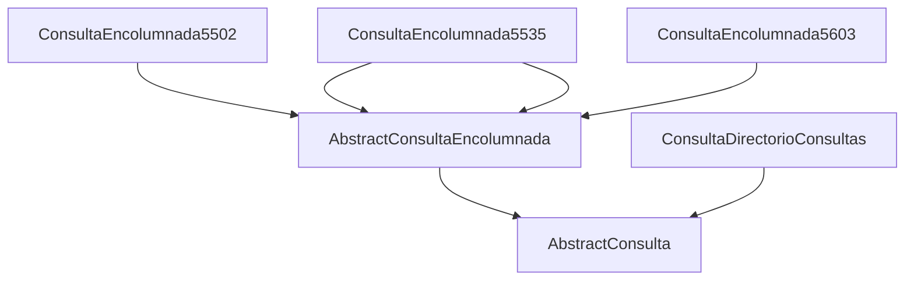

 
## Descripción

 - Pequeño proyecto kotlin, que muestra 4 ejemplos de peticiones al WS de OMIE. 

 - Solo se tienen que asignar los valores a la variables
   `certPath` y `certPassword` del archivo *Main.kt* 
 - Para generar nuevas peticiones a otras consultas (por ejemplo consulta encolumnadas), solo se tiene que crear una nueva clase en el paquete 'omie.ws.consultas' que extienda de `AbstractConsultaEncolumnada<OBJECTO_RESULTADO>`
	 - OBJECTO_RESULTADO: tipo datos que devolverá la función 'getResult'
	 - En el constructor debe recibir los parámetros  necesarios para generar la petición y generar la cadena de texto de estos parámetros (que se usaran en 'AbstractConsulta.call')
	- Implementar la función 'getResult(n: Node): OBJECTO_RESULTADO' donde está recibirá como parámetro la cadena de texto del resultado de la petición y donde iremos parseando para generar nuestro/s objeto/s de datos para posteriormente poderlos tratar de forma más  fácil.

 - Se ha utilizado Java 11 para hacer el proyecto

## Peticiones de ejemplo
 - Listado consultas disponibles en el WS de OMIE.
 - 5502: Precios mercado Intradiario.
 - 5603: Precios Mercado Intradiario. Resultados de la Casación.
 - 5535: Importe agregado de la liquidación del ajuste de los costes de producción de energía eléctrica.

## Estructura de clases

## Output
 
    PETICION LISTADO CONSULTAS DISPONIBLES
    ConsultaDirectorioConsultasSeccionData(titulo=Mercado Diario. Ofertas, consultas=[ConsultaDirectorioConsultasConsultaData(codConsulta=5165, titulo=Ofertas Normales, tipoConsulta=ENCOL), ConsultaDirectorioConsultasConsultaData(codConsulta=1504, titulo=Datos Estructurales, tipoConsulta=ANEXO), ConsultaDirectorioConsultasConsultaData(codConsulta=5161, titulo=Ofertas por Defecto Válidas, tipoConsulta=ENCOL), ConsultaDirectorioConsultasConsultaData(codConsulta=5229, titulo=Ofertas paradójicamente rechazadas en la casación, tipoConsulta=ENCOL), ConsultaDirectorioConsultasConsultaData(codConsulta=5151, titulo=Ofertas que superan los umbrales de precios, tipoConsulta=ENCOL), ConsultaDirectorioConsultasConsultaData(codConsulta=5159, titulo=Histórico de Ofertas Normales de una Unidad Ofertante, tipoConsulta=ENCOL), ConsultaDirectorioConsultasConsultaData(codConsulta=5187, titulo=Histórico de Ofertas por Defecto de una Unidad Ofertante, tipoConsulta=ENCOL), ConsultaDirectorioConsultasConsultaData(codConsulta=5114, titulo=Detalle Anulaciones de una Oferta por Defecto, tipoConsulta=ENCOL), ConsultaDirectorioConsultasConsultaData(codConsulta=5192, titulo=Unidades Ofertantes sin Oferta válida para la Casación, tipoConsulta=ENCOL), ConsultaDirectorioConsultasConsultaData(codConsulta=5120, titulo=Estado de garantías para la próxima sesión del Mercado Diario, tipoConsulta=ENCOL), ConsultaDirectorioConsultasConsultaData(codConsulta=5121, titulo=Detalle de ofertas y posiciones a plazo para la próxima sesión del Mercado Diario, tipoConsulta=ENCOL), ConsultaDirectorioConsultasConsultaData(codConsulta=5122, titulo=Detalle de posiciones a plazo para la próxima sesión del Mercado Diario, tipoConsulta=ENCOL), ConsultaDirectorioConsultasConsultaData(codConsulta=5150, titulo=Consulta de activación de ofertas automáticas, tipoConsulta=ENCOL)])
    ConsultaDirectorioConsultasSeccionData(titulo=Mercado Diario. Contratos Bilaterales, consultas=[ConsultaDirectorioConsultasConsultaData(codConsulta=5809, titulo=Ejecuciones de Contratos Bilaterales por Unidad Ofertante, tipoConsulta=ENCOL), ConsultaDirectorioConsultasConsultaData(codConsulta=5806, titulo=Ejecuciones Normales de Contratos Bilaterales por Fecha de Vigencia, tipoConsulta=ENCOL), ConsultaDirectorioConsultasConsultaData(codConsulta=5804, titulo=Ejecuciones de Contratos Bilaterales por Nº de Contrato Bilateral, tipoConsulta=ENCOL), ConsultaDirectorioConsultasConsultaData(codConsulta=5803, titulo=Detalle de una Ejecución de Contrato Bilateral, tipoConsulta=ENCOL), ConsultaDirectorioConsultasConsultaData(codConsulta=5812, titulo=Histórico de Ejecuciones por Defecto de un Contrato Bilateral, tipoConsulta=ENCOL), ConsultaDirectorioConsultasConsultaData(codConsulta=5807, titulo=Ejecuciones de Contratos Bilaterales Válidas por Defecto, tipoConsulta=ENCOL), ConsultaDirectorioConsultasConsultaData(codConsulta=5810, titulo=Histórico de Ejecuciones Normales de Contratos Bilaterales por Agente, tipoConsulta=ENCOL), ConsultaDirectorioConsultasConsultaData(codConsulta=5224, titulo=Ejecuciones de CB aceptadas al cierre de los periodos de inserción, tipoConsulta=ENCOL), ConsultaDirectorioConsultasConsultaData(codConsulta=5216, titulo=Ejecuciones de CBF rechazadas al cierre de los periodos de inserción, tipoConsulta=ENCOL), ConsultaDirectorioConsultasConsultaData(codConsulta=5802, titulo=Contrato Bilateral por Agente, tipoConsulta=ENCOL), ConsultaDirectorioConsultasConsultaData(codConsulta=5814, titulo=Ejecuciones CBF previas al MD, tipoConsulta=ENCOL), ConsultaDirectorioConsultasConsultaData(codConsulta=5815, titulo=Ejecuciones CBF previas al MD por operador, tipoConsulta=ENCOL)])
    ConsultaDirectorioConsultasSeccionData(titulo=Mercado Diario. Régimen Especial, consultas=[ConsultaDirectorioConsultasConsultaData(codConsulta=5905, titulo=Excedentes de Producción en Régimen Especial y Autoproductores por agente, tipoConsulta=ENCOL), ConsultaDirectorioConsultasConsultaData(codConsulta=5906, titulo=Excedentes de Producción en Régimen Especial y Autoproductores por UO origen/destino, tipoConsulta=ENCOL), ConsultaDirectorioConsultasConsultaData(codConsulta=5904, titulo=Excedentes de Producción en Régimen Especial y Autoproductores por fecha, tipoConsulta=ENCOL), ConsultaDirectorioConsultasConsultaData(codConsulta=5901, titulo=Detalle excedentes de Producción en Régimen Especial y Autoproductores, tipoConsulta=ENCOL), ConsultaDirectorioConsultasConsultaData(codConsulta=5915, titulo=Declaraciones para una sesión, tipoConsulta=ENCOL), ConsultaDirectorioConsultasConsultaData(codConsulta=5916, titulo=Declaraciones por Defecto Válidas, tipoConsulta=ENCOL), ConsultaDirectorioConsultasConsultaData(codConsulta=5911, titulo=Detalle de Declaración, tipoConsulta=ENCOL), ConsultaDirectorioConsultasConsultaData(codConsulta=5930, titulo=Producción resultante en el Mercado Diario, tipoConsulta=ENCOL), ConsultaDirectorioConsultasConsultaData(codConsulta=5931, titulo=Producción resultante total, tipoConsulta=ENCOL)])
    ConsultaDirectorioConsultasSeccionData(titulo=Mercado Diario. Desgloses, consultas=[ConsultaDirectorioConsultasConsultaData(codConsulta=5950, titulo=Desglose por unidad, tipoConsulta=ENCOL)])
    ConsultaDirectorioConsultasSeccionData(titulo=Mercado Diario. Resultados de la Casación, consultas=[ConsultaDirectorioConsultasConsultaData(codConsulta=5202, titulo=Precios resultado de la Casación, tipoConsulta=ENCOL), ConsultaDirectorioConsultasConsultaData(codConsulta=5218, titulo=Precios límite del Mercado Diario, tipoConsulta=ENCOL), ConsultaDirectorioConsultasConsultaData(codConsulta=5733, titulo=Retenciones realizadas durante el proceso de preparación de la Casación, tipoConsulta=ENCOL), ConsultaDirectorioConsultasConsultaData(codConsulta=5732, titulo=Ofertas Válidas no seleccionadas en el proceso de preparación de la Casación, tipoConsulta=ENCOL), ConsultaDirectorioConsultasConsultaData(codConsulta=5225, titulo=Ofertas Aceptadas en el proceso de preparación de la Casación, tipoConsulta=ENCOL), ConsultaDirectorioConsultasConsultaData(codConsulta=5215, titulo=Ofertas rechazadas en el proceso de preparación de ofertas para la casación, tipoConsulta=ENCOL), ConsultaDirectorioConsultasConsultaData(codConsulta=6300, titulo=Precios del gas natural, tipoConsulta=ENCOL), ConsultaDirectorioConsultasConsultaData(codConsulta=6301, titulo=Unidades ofertantes de venta con derecho a ajuste según lo dispuesto en el Art. 2.1 del RDL 10/2022 de España y el Art. 2.1 a) y b) del DL n.º 33/2022 de Portugal, tipoConsulta=ENCOL), ConsultaDirectorioConsultasConsultaData(codConsulta=5223, titulo=Energías PBC por unidad ofertante, tipoConsulta=ENCOL), ConsultaDirectorioConsultasConsultaData(codConsulta=5220, titulo=Energías PBC por agente, tipoConsulta=ENCOL), ConsultaDirectorioConsultasConsultaData(codConsulta=5338, titulo=Capacidad en Intercambios Internacionales, tipoConsulta=ENCOL), ConsultaDirectorioConsultasConsultaData(codConsulta=5222, titulo=Energías PBF por unidad ofertante, tipoConsulta=ENCOL), ConsultaDirectorioConsultasConsultaData(codConsulta=5227, titulo=Energías PBF por unidad de programación, tipoConsulta=ENCOL), ConsultaDirectorioConsultasConsultaData(codConsulta=5226, titulo=Energías PBF por Agente, tipoConsulta=ENCOL), ConsultaDirectorioConsultasConsultaData(codConsulta=5716, titulo=Capacidad y ocupación de importación y exportación después del mercado, tipoConsulta=ENCOL)])
    ConsultaDirectorioConsultasSeccionData(titulo=Mercado Diario. Procesos posteriores al PBF, consultas=[ConsultaDirectorioConsultasConsultaData(codConsulta=5302, titulo=Energías PVD por unidad ofertante, tipoConsulta=ENCOL), ConsultaDirectorioConsultasConsultaData(codConsulta=5304, titulo=Energías PVD por unidad de programación, tipoConsulta=ENCOL), ConsultaDirectorioConsultasConsultaData(codConsulta=5350, titulo=Energías PVD por agente, tipoConsulta=ENCOL), ConsultaDirectorioConsultasConsultaData(codConsulta=5315, titulo=Redespachos del PVD/PVP, tipoConsulta=ENCOL), ConsultaDirectorioConsultasConsultaData(codConsulta=5339, titulo=Redespachos por Restricciones de Seguridad, tipoConsulta=ENCOL), ConsultaDirectorioConsultasConsultaData(codConsulta=5337, titulo=Excesos de energía de intercambios internacionales para la gestión de restricciones, tipoConsulta=ENCOL), ConsultaDirectorioConsultasConsultaData(codConsulta=5347, titulo=Limitaciones a las unidades ofertantes por estudio de seguridad, tipoConsulta=ENCOL), ConsultaDirectorioConsultasConsultaData(codConsulta=5722, titulo=Capacidad y ocupación de importación y exportación después de las restricciones, tipoConsulta=ENCOL), ConsultaDirectorioConsultasConsultaData(codConsulta=5107, titulo=Diferencia entre la energía asimilada a CBF y ejecutada, tipoConsulta=ENCOL)])
    ConsultaDirectorioConsultasSeccionData(titulo=Mercado Diario. Información sobre Sesiones, consultas=[ConsultaDirectorioConsultasConsultaData(codConsulta=5212, titulo=Casaciones del Mercado Diario, tipoConsulta=ENCOL)])
    ConsultaDirectorioConsultasSeccionData(titulo=Mercado Diario. Desagregaciones, consultas=[ConsultaDirectorioConsultasConsultaData(codConsulta=5970, titulo=Desagregaciones al Mercado Diario por sesión, tipoConsulta=ENCOL), ConsultaDirectorioConsultasConsultaData(codConsulta=5971, titulo=Desagregaciones al Mercado Diario por Unidad Ofertante y fecha, tipoConsulta=ENCOL), ConsultaDirectorioConsultasConsultaData(codConsulta=5975, titulo=Detalles de una desagregación, tipoConsulta=ENCOL)])
    ConsultaDirectorioConsultasSeccionData(titulo=Mercado Diario. Desagregaciones de Contratación a Plazo, consultas=[ConsultaDirectorioConsultasConsultaData(codConsulta=5981, titulo=Posiciones abiertas enviadas por OMIP, tipoConsulta=ENCOL), ConsultaDirectorioConsultasConsultaData(codConsulta=5982, titulo=Desagregaciones de Contratación a Plazo por sesión, tipoConsulta=ENCOL), ConsultaDirectorioConsultasConsultaData(codConsulta=5983, titulo=Desagregaciones de Contratación a Plazo por UCP, tipoConsulta=ENCOL), ConsultaDirectorioConsultasConsultaData(codConsulta=5984, titulo=Detalles de desagregación de Contratación a Plazo, tipoConsulta=ENCOL), ConsultaDirectorioConsultasConsultaData(codConsulta=5985, titulo=Unidades ofertantes con compromisos a plazo sin desagregación válida, tipoConsulta=ENCOL), ConsultaDirectorioConsultasConsultaData(codConsulta=5986, titulo=Compromisos de contratación a plazo no integrados en el Mercado Diario, tipoConsulta=ENCOL), ConsultaDirectorioConsultasConsultaData(codConsulta=5987, titulo=Listado de "Delivery Buckets" por año, tipoConsulta=ENCOL), ConsultaDirectorioConsultasConsultaData(codConsulta=5988, titulo=Unidades de Contratación a Plazo del Agente, tipoConsulta=ENCOL), ConsultaDirectorioConsultasConsultaData(codConsulta=5989, titulo=Unidades Ofertantes relacionadas por UCP, tipoConsulta=ENCOL)])
    ConsultaDirectorioConsultasSeccionData(titulo=Mercado Diario. Energías comprometidas, consultas=[ConsultaDirectorioConsultasConsultaData(codConsulta=5820, titulo=Números de comunicación (por Grupo Empresarial Adquirente), tipoConsulta=ENCOL), ConsultaDirectorioConsultasConsultaData(codConsulta=5821, titulo=Energías comprometidas por sesión, tipoConsulta=ENCOL)])
    ConsultaDirectorioConsultasSeccionData(titulo=Mercado Intradiario. Ofertas, consultas=[ConsultaDirectorioConsultasConsultaData(codConsulta=5503, titulo=Ofertas para una sesión, tipoConsulta=ENCOL), ConsultaDirectorioConsultasConsultaData(codConsulta=5720, titulo=Limitaciones vigentes del OS a las Zonas, tipoConsulta=ENCOL), ConsultaDirectorioConsultasConsultaData(codConsulta=5718, titulo=Limitaciones del OS por Zona, tipoConsulta=ENCOL), ConsultaDirectorioConsultasConsultaData(codConsulta=5711, titulo=Limitaciones zonales vigentes para MI, tipoConsulta=ENCOL), ConsultaDirectorioConsultasConsultaData(codConsulta=5504, titulo=Ofertas inválidas por sesión, tipoConsulta=ENCOL), ConsultaDirectorioConsultasConsultaData(codConsulta=5510, titulo=Histórico de Ofertas de una unidad ofertante, tipoConsulta=ENCOL), ConsultaDirectorioConsultasConsultaData(codConsulta=5502, titulo=Ofertas que superan los umbrales de precios, tipoConsulta=ENCOL), ConsultaDirectorioConsultasConsultaData(codConsulta=5508, titulo=Unidades ofertantes no presentadas, tipoConsulta=ENCOL), ConsultaDirectorioConsultasConsultaData(codConsulta=5520, titulo=Estado de garantías para la sesión actual del Mercado Intradiario, tipoConsulta=ENCOL), ConsultaDirectorioConsultasConsultaData(codConsulta=5521, titulo=Detalle de ofertas para la sesión actual del Mercado Intradiario, tipoConsulta=ENCOL)])
    ConsultaDirectorioConsultasSeccionData(titulo=Mercado Intradiario. Régimen Especial, consultas=[ConsultaDirectorioConsultasConsultaData(codConsulta=5925, titulo=Declaraciones para una sesión, tipoConsulta=ENCOL), ConsultaDirectorioConsultasConsultaData(codConsulta=5921, titulo=Detalle de Declaración, tipoConsulta=ENCOL), ConsultaDirectorioConsultasConsultaData(codConsulta=5932, titulo=Producción resultante en el Mercado Intradiario, tipoConsulta=ENCOL)])
    ConsultaDirectorioConsultasSeccionData(titulo=Mercado Intradiario. Desgloses, consultas=[ConsultaDirectorioConsultasConsultaData(codConsulta=5960, titulo=Desglose por unidad, tipoConsulta=ENCOL)])
    ConsultaDirectorioConsultasSeccionData(titulo=Mercado Intradiario. Resultados de la Casación, consultas=[ConsultaDirectorioConsultasConsultaData(codConsulta=5603, titulo=Precios Resultado de la Casación, tipoConsulta=ENCOL), ConsultaDirectorioConsultasConsultaData(codConsulta=5607, titulo=Precios límite del Mercado Intradiario, tipoConsulta=ENCOL), ConsultaDirectorioConsultasConsultaData(codConsulta=5604, titulo=Ofertas Aceptadas en el proceso de preparación de la Casación, tipoConsulta=ENCOL), ConsultaDirectorioConsultasConsultaData(codConsulta=5605, titulo=Ofertas rechazadas en el proceso de preparación de la Casación, tipoConsulta=ENCOL), ConsultaDirectorioConsultasConsultaData(codConsulta=5602, titulo=Energías PIBCI por unidad ofertante, tipoConsulta=ENCOL), ConsultaDirectorioConsultasConsultaData(codConsulta=5620, titulo=Energías PIBCI por agente. Incrementos[+] y decrementos[-] de posición, tipoConsulta=ENCOL), ConsultaDirectorioConsultasConsultaData(codConsulta=5621, titulo=Energías PIBCI por agente. Sesión 1, tipoConsulta=ENCOL), ConsultaDirectorioConsultasConsultaData(codConsulta=5622, titulo=Energías PIBCI por agente. Sesión 2, tipoConsulta=ENCOL), ConsultaDirectorioConsultasConsultaData(codConsulta=5623, titulo=Energías PIBCI por agente. Sesión 3, tipoConsulta=ENCOL), ConsultaDirectorioConsultasConsultaData(codConsulta=5624, titulo=Energías PIBCI por agente. Sesión 4, tipoConsulta=ENCOL), ConsultaDirectorioConsultasConsultaData(codConsulta=5625, titulo=Energías PIBCI por agente. Sesión 5, tipoConsulta=ENCOL), ConsultaDirectorioConsultasConsultaData(codConsulta=5626, titulo=Energías PIBCI por agente. Sesión 6, tipoConsulta=ENCOL), ConsultaDirectorioConsultasConsultaData(codConsulta=5601, titulo=Energías PIBCA por unidad ofertante, tipoConsulta=ENCOL), ConsultaDirectorioConsultasConsultaData(codConsulta=5631, titulo=Energías PIBCA por agente. Sesión 1, tipoConsulta=ENCOL), ConsultaDirectorioConsultasConsultaData(codConsulta=5630, titulo=Energías PIBCA por agente., tipoConsulta=ENCOL), ConsultaDirectorioConsultasConsultaData(codConsulta=5632, titulo=Energías PIBCA por agente. Sesión 2, tipoConsulta=ENCOL), ConsultaDirectorioConsultasConsultaData(codConsulta=5633, titulo=Energías PIBCA por agente. Sesión 3, tipoConsulta=ENCOL), ConsultaDirectorioConsultasConsultaData(codConsulta=5634, titulo=Energías PIBCA por agente. Sesión 4, tipoConsulta=ENCOL), ConsultaDirectorioConsultasConsultaData(codConsulta=5635, titulo=Energías PIBCA por agente. Sesión 5, tipoConsulta=ENCOL), ConsultaDirectorioConsultasConsultaData(codConsulta=5636, titulo=Energías PIBCA por agente. Sesión 6, tipoConsulta=ENCOL), ConsultaDirectorioConsultasConsultaData(codConsulta=5608, titulo=Programa Horario Final de la Casación Intradiaria, tipoConsulta=ENCOL), ConsultaDirectorioConsultasConsultaData(codConsulta=5606, titulo=Energías PHF por unidad de programación, tipoConsulta=ENCOL), ConsultaDirectorioConsultasConsultaData(codConsulta=5641, titulo=Energías PHF por agente. Sesión 1, tipoConsulta=ENCOL), ConsultaDirectorioConsultasConsultaData(codConsulta=5640, titulo=Energías PHF por agente., tipoConsulta=ENCOL), ConsultaDirectorioConsultasConsultaData(codConsulta=5642, titulo=Energías PHF por agente. Sesión 2, tipoConsulta=ENCOL), ConsultaDirectorioConsultasConsultaData(codConsulta=5643, titulo=Energías PHF por agente. Sesión 3, tipoConsulta=ENCOL), ConsultaDirectorioConsultasConsultaData(codConsulta=5644, titulo=Energías PHF por agente. Sesión 4, tipoConsulta=ENCOL), ConsultaDirectorioConsultasConsultaData(codConsulta=5645, titulo=Energías PHF por agente. Sesión 5, tipoConsulta=ENCOL), ConsultaDirectorioConsultasConsultaData(codConsulta=5646, titulo=Energías PHF por agente. Sesión 6, tipoConsulta=ENCOL), ConsultaDirectorioConsultasConsultaData(codConsulta=5611, titulo=Energía asimilada a CBF del Grupo. Sesión 1, tipoConsulta=ENCOL), ConsultaDirectorioConsultasConsultaData(codConsulta=5612, titulo=Energía asimilada a CBF del Grupo. Sesión 2, tipoConsulta=ENCOL), ConsultaDirectorioConsultasConsultaData(codConsulta=5613, titulo=Energía asimilada a CBF del Grupo. Sesión 3, tipoConsulta=ENCOL), ConsultaDirectorioConsultasConsultaData(codConsulta=5614, titulo=Energía asimilada a CBF del Grupo. Sesión 4, tipoConsulta=ENCOL), ConsultaDirectorioConsultasConsultaData(codConsulta=5615, titulo=Energía asimilada a CBF del Grupo. Sesión 5, tipoConsulta=ENCOL), ConsultaDirectorioConsultasConsultaData(codConsulta=5616, titulo=Energía asimilada a CBF del Grupo. Sesión 6, tipoConsulta=ENCOL), ConsultaDirectorioConsultasConsultaData(codConsulta=5651, titulo=Energía asimilada a CBF del Agente. Sesión 1, tipoConsulta=ENCOL), ConsultaDirectorioConsultasConsultaData(codConsulta=5652, titulo=Energía asimilada a CBF del Agente. Sesión 2, tipoConsulta=ENCOL), ConsultaDirectorioConsultasConsultaData(codConsulta=5653, titulo=Energía asimilada a CBF del Agente. Sesión 3, tipoConsulta=ENCOL), ConsultaDirectorioConsultasConsultaData(codConsulta=5654, titulo=Energía asimilada a CBF del Agente. Sesión 4, tipoConsulta=ENCOL), ConsultaDirectorioConsultasConsultaData(codConsulta=5655, titulo=Energía asimilada a CBF del Agente. Sesión 5, tipoConsulta=ENCOL), ConsultaDirectorioConsultasConsultaData(codConsulta=5656, titulo=Energía asimilada a CBF del Agente. Sesión 6, tipoConsulta=ENCOL), ConsultaDirectorioConsultasConsultaData(codConsulta=5660, titulo=Energías acumuladas a unidades con derechos transfronterizos, tipoConsulta=ENCOL), ConsultaDirectorioConsultasConsultaData(codConsulta=5724, titulo=Capacidades comerciales e intercambios intracomunitarios e internacionales, tipoConsulta=ENCOL), ConsultaDirectorioConsultasConsultaData(codConsulta=5670, titulo=Información del OS vigente para una sesión, tipoConsulta=ENCOL), ConsultaDirectorioConsultasConsultaData(codConsulta=5728, titulo=Limitaciones por UP de un fichero, tipoConsulta=ENCOL), ConsultaDirectorioConsultasConsultaData(codConsulta=5727, titulo=Limitaciones por UOF de un fichero, tipoConsulta=ENCOL), ConsultaDirectorioConsultasConsultaData(codConsulta=5726, titulo=Indisponibilidades de unidades físicas de un fichero, tipoConsulta=ENCOL), ConsultaDirectorioConsultasConsultaData(codConsulta=5723, titulo=Limitaciones zonales del OS de un fichero, tipoConsulta=ENCOL), ConsultaDirectorioConsultasConsultaData(codConsulta=5725, titulo=Indisponibilidades de UO de un fichero, tipoConsulta=ENCOL)])
    ConsultaDirectorioConsultasSeccionData(titulo=Mercado Intradiario. Información Mercados Intradiarios, consultas=[ConsultaDirectorioConsultasConsultaData(codConsulta=5703, titulo=Energías PVD por unidad ofertante, tipoConsulta=ENCOL), ConsultaDirectorioConsultasConsultaData(codConsulta=5329, titulo=Redespachos por análisis de seguridad: OS y OM, tipoConsulta=ENCOL), ConsultaDirectorioConsultasConsultaData(codConsulta=5609, titulo=Despacho de energías incrementales y totales, tipoConsulta=ENCOL), ConsultaDirectorioConsultasConsultaData(codConsulta=5214, titulo=Casaciones del Mercado Intradiario, tipoConsulta=ENCOL)])
    ConsultaDirectorioConsultasSeccionData(titulo=Mercado Intradiario. Información sobre Sesiones, consultas=[ConsultaDirectorioConsultasConsultaData(codConsulta=5501, titulo=Próximas sesiones, tipoConsulta=ENCOL), ConsultaDirectorioConsultasConsultaData(codConsulta=5213, titulo=Información de las sesiones, tipoConsulta=ENCOL), ConsultaDirectorioConsultasConsultaData(codConsulta=5340, titulo=Horas suspendidas (MI), tipoConsulta=ENCOL)])
    ConsultaDirectorioConsultasSeccionData(titulo=Mercado Intradiario. Desagregaciones, consultas=[ConsultaDirectorioConsultasConsultaData(codConsulta=5972, titulo=Desagregaciones al Mercado Intradiario por sesión, tipoConsulta=ENCOL), ConsultaDirectorioConsultasConsultaData(codConsulta=5973, titulo=Desagregaciones al Mercado Intradiario por Unidad Ofertante y fecha, tipoConsulta=ENCOL)])
    ConsultaDirectorioConsultasSeccionData(titulo=Servicios Complementarios, consultas=[ConsultaDirectorioConsultasConsultaData(codConsulta=5309, titulo=Asignación Banda PVD, tipoConsulta=ENCOL), ConsultaDirectorioConsultasConsultaData(codConsulta=5311, titulo=Precio Banda PVD, tipoConsulta=ENCOL), ConsultaDirectorioConsultasConsultaData(codConsulta=5361, titulo=Asignación Energía Secundaria, tipoConsulta=ENCOL), ConsultaDirectorioConsultasConsultaData(codConsulta=5322, titulo=Precio Energía Secundaria, tipoConsulta=ENCOL), ConsultaDirectorioConsultasConsultaData(codConsulta=5310, titulo=Asignación Energía Terciaria, tipoConsulta=ENCOL), ConsultaDirectorioConsultasConsultaData(codConsulta=5335, titulo=Desvíos Gestionados, tipoConsulta=ENCOL), ConsultaDirectorioConsultasConsultaData(codConsulta=5314, titulo=Redespachos en tiempo real, tipoConsulta=ENCOL)])
    ConsultaDirectorioConsultasSeccionData(titulo=Mercado continuo. Contratos, consultas=[ConsultaDirectorioConsultasConsultaData(codConsulta=4100, titulo=Contratos en negociación, tipoConsulta=ENCOL), ConsultaDirectorioConsultasConsultaData(codConsulta=4101, titulo=Próximos contratos, tipoConsulta=ENCOL), ConsultaDirectorioConsultasConsultaData(codConsulta=4102, titulo=Histórico de contratos, tipoConsulta=ENCOL)])
    ConsultaDirectorioConsultasSeccionData(titulo=Mercado continuo. Órdenes, consultas=[ConsultaDirectorioConsultasConsultaData(codConsulta=4113, titulo=Órdenes por ronda, tipoConsulta=ENCOL), ConsultaDirectorioConsultasConsultaData(codConsulta=4110, titulo=Órdenes por contrato, tipoConsulta=ENCOL), ConsultaDirectorioConsultasConsultaData(codConsulta=4128, titulo=Órdenes rechazadas en el proceso automático de reactivación tras la casación del MI, tipoConsulta=ENCOL), ConsultaDirectorioConsultasConsultaData(codConsulta=4111, titulo=Órdenes casadas, tipoConsulta=ENCOL), ConsultaDirectorioConsultasConsultaData(codConsulta=4115, titulo=Órdenes que superan los umbrales de precios, tipoConsulta=ENCOL), ConsultaDirectorioConsultasConsultaData(codConsulta=4112, titulo=Histórico de órdenes, tipoConsulta=ENCOL), ConsultaDirectorioConsultasConsultaData(codConsulta=4114, titulo=Órdenes aceptadas en el proceso automático de reactivación tras la casación del MI, tipoConsulta=ENCOL)])
    ConsultaDirectorioConsultasSeccionData(titulo=Mercado continuo. Resultados, consultas=[ConsultaDirectorioConsultasConsultaData(codConsulta=4127, titulo=Lista completa de transacciones por contrato, tipoConsulta=ENCOL), ConsultaDirectorioConsultasConsultaData(codConsulta=4124, titulo=Transacciones por ronda, tipoConsulta=ENCOL), ConsultaDirectorioConsultasConsultaData(codConsulta=4120, titulo=Transacciones por contrato del agente, tipoConsulta=ENCOL), ConsultaDirectorioConsultasConsultaData(codConsulta=4125, titulo=Precios y energías del Mercado Continuo, tipoConsulta=ENCOL), ConsultaDirectorioConsultasConsultaData(codConsulta=4129, titulo=Precios por periodo en cada ronda, tipoConsulta=ENCOL), ConsultaDirectorioConsultasConsultaData(codConsulta=4155, titulo=Precios límite del Mercado Continuo, tipoConsulta=ENCOL), ConsultaDirectorioConsultasConsultaData(codConsulta=4121, titulo=Histórico de Transacciones, tipoConsulta=ENCOL), ConsultaDirectorioConsultasConsultaData(codConsulta=4122, titulo=Posición neta del Mercado Continuo por unidad, tipoConsulta=ENCOL), ConsultaDirectorioConsultasConsultaData(codConsulta=4126, titulo=Posición neta del Mercado Continuo por agente, tipoConsulta=ENCOL), ConsultaDirectorioConsultasConsultaData(codConsulta=4123, titulo=Anotaciones de Mercado Continuo por Agente, tipoConsulta=ENCOL), ConsultaDirectorioConsultasConsultaData(codConsulta=4103, titulo=Rondas por día, tipoConsulta=ENCOL), ConsultaDirectorioConsultasConsultaData(codConsulta=4152, titulo=Información del OS vigente para una ronda, tipoConsulta=ENCOL), ConsultaDirectorioConsultasConsultaData(codConsulta=4150, titulo=Indisponibilidades vigentes para el Mercado Continuo por ronda, tipoConsulta=ENCOL), ConsultaDirectorioConsultasConsultaData(codConsulta=4151, titulo=Limitaciones unitarias vigentes para Mercado Continuo por ronda, tipoConsulta=ENCOL), ConsultaDirectorioConsultasConsultaData(codConsulta=4153, titulo=Horas suspendidas (MIC), tipoConsulta=ENCOL)])
    ConsultaDirectorioConsultasSeccionData(titulo=Mercado continuo. Garantías, consultas=[ConsultaDirectorioConsultasConsultaData(codConsulta=4130, titulo=Límite operativo en un instante determinado, tipoConsulta=ENCOL), ConsultaDirectorioConsultasConsultaData(codConsulta=4131, titulo=Desglose de anotaciones del límite operativo en un instante determinado, tipoConsulta=ENCOL), ConsultaDirectorioConsultasConsultaData(codConsulta=4132, titulo=Datos utilizados en cada proceso de sincronización de garantías, tipoConsulta=ENCOL), ConsultaDirectorioConsultasConsultaData(codConsulta=4170, titulo=Desagregaciones a unidades portfolio por ronda y unidad portfolio, tipoConsulta=ENCOL), ConsultaDirectorioConsultasConsultaData(codConsulta=4174, titulo=Unidades de oferta de la misma actividad y zona de un porfolio, tipoConsulta=ENCOL), ConsultaDirectorioConsultasConsultaData(codConsulta=4175, titulo=Unidades portfolio, tipoConsulta=ENCOL)])
    ConsultaDirectorioConsultasSeccionData(titulo=Mercado continuo. Programas, consultas=[ConsultaDirectorioConsultasConsultaData(codConsulta=4140, titulo=Energías PIBCIC por Unidad. Incrementos[+] y decrementos[-] de posición, tipoConsulta=ENCOL), ConsultaDirectorioConsultasConsultaData(codConsulta=4141, titulo=Energías PIBCIC por agente. Incrementos[+] y decrementos[-] de posición, tipoConsulta=ENCOL), ConsultaDirectorioConsultasConsultaData(codConsulta=4142, titulo=Energías PIBCAC por unidad, tipoConsulta=ENCOL), ConsultaDirectorioConsultasConsultaData(codConsulta=4143, titulo=Energías PIBCAC por agente., tipoConsulta=ENCOL), ConsultaDirectorioConsultasConsultaData(codConsulta=4144, titulo=Energías PHFC por Unidad, tipoConsulta=ENCOL), ConsultaDirectorioConsultasConsultaData(codConsulta=4145, titulo=Energías PHFC por agente., tipoConsulta=ENCOL)])
    ConsultaDirectorioConsultasSeccionData(titulo=Mercado continuo. Desagregaciones, consultas=[ConsultaDirectorioConsultasConsultaData(codConsulta=4171, titulo=Detalles de desagregación de unidades portfolio, tipoConsulta=ENCOL), ConsultaDirectorioConsultasConsultaData(codConsulta=4172, titulo=Histórico de desagregaciones por agente, tipoConsulta=ENCOL), ConsultaDirectorioConsultasConsultaData(codConsulta=4173, titulo=Posición desagregada por ronda y unidad portfolio, tipoConsulta=ENCOL)])
    ConsultaDirectorioConsultasSeccionData(titulo=Liquidaciones. Datos Generales, consultas=[ConsultaDirectorioConsultasConsultaData(codConsulta=5401, titulo=Empresas y Grupos de Garantías accesibles por el Agente, tipoConsulta=ENCOL), ConsultaDirectorioConsultasConsultaData(codConsulta=5406, titulo=Detalle del cálculo del reparto de intereses por agente, tipoConsulta=ENCOL), ConsultaDirectorioConsultasConsultaData(codConsulta=5410, titulo=Cuentas bancarias para pagos de liquidaciones y depósitos de garantías en efectivo, tipoConsulta=ENCOL), ConsultaDirectorioConsultasConsultaData(codConsulta=5411, titulo=Cuenta bancaria para pagos de liquidaciones y depósitos de garantías en efectivo, tipoConsulta=ENCOL), ConsultaDirectorioConsultasConsultaData(codConsulta=5408, titulo=Detalle del cálculo del reparto de intereses por empresa, tipoConsulta=ENCOL), ConsultaDirectorioConsultasConsultaData(codConsulta=5402, titulo=Participaciones en Unidades, tipoConsulta=ENCOL)])
    ConsultaDirectorioConsultasSeccionData(titulo=Liquidaciones. Resultados de las liquidaciones, consultas=[ConsultaDirectorioConsultasConsultaData(codConsulta=5403, titulo=Avance de liquidacion mensual  ( Importes en euros a partir de  1/3/2001), tipoConsulta=ENCOL), ConsultaDirectorioConsultasConsultaData(codConsulta=5405, titulo=Avance de Anotaciones en Cuenta ( Importes en euros a partir de  1/3/2001), tipoConsulta=ENCOL), ConsultaDirectorioConsultasConsultaData(codConsulta=5407, titulo=Datos de Liquidaciones, tipoConsulta=ENCOL), ConsultaDirectorioConsultasConsultaData(codConsulta=5409, titulo=Anotaciones en Cuenta  ( Importes en euros a partir de  1/3/2001), tipoConsulta=ENCOL), ConsultaDirectorioConsultasConsultaData(codConsulta=5420, titulo=Calendario de liquidaciones mensuales (hasta septiembre 2006), tipoConsulta=ENCOL), ConsultaDirectorioConsultasConsultaData(codConsulta=5421, titulo=Calendario y estado de liquidación diaria, tipoConsulta=ENCOL), ConsultaDirectorioConsultasConsultaData(codConsulta=5423, titulo=Motivos de provisionalidad de las liquidaciones diarias, tipoConsulta=ENCOL), ConsultaDirectorioConsultasConsultaData(codConsulta=5433, titulo=Avance de export. e import. con terceros países, tipoConsulta=ENCOL), ConsultaDirectorioConsultasConsultaData(codConsulta=6251, titulo=Detalle de la nota agregada de cargo o abono, tipoConsulta=ENCOL), ConsultaDirectorioConsultasConsultaData(codConsulta=6252, titulo=Detalle de los pagos efectuados a los agentes acreedores en caso de prorrateo, tipoConsulta=ENCOL), ConsultaDirectorioConsultasConsultaData(codConsulta=6250, titulo=Cobros y pagos por empresa, tipoConsulta=ENCOL), ConsultaDirectorioConsultasConsultaData(codConsulta=5992, titulo=Desgloses CIL enviadas por fecha de sesión y agente, tipoConsulta=ENCOL), ConsultaDirectorioConsultasConsultaData(codConsulta=5994, titulo=Relación de deudas comunicadas por la CNMC, tipoConsulta=ENCOL), ConsultaDirectorioConsultasConsultaData(codConsulta=5993, titulo=Resultados de la liquidación por CIL, tipoConsulta=ENCOL), ConsultaDirectorioConsultasConsultaData(codConsulta=5995, titulo=Retenciones practicadas de la liquidación del Mercado, tipoConsulta=ENCOL)])
    ConsultaDirectorioConsultasSeccionData(titulo=Liquidaciones. Garantias de pago, consultas=[ConsultaDirectorioConsultasConsultaData(codConsulta=5441, titulo=Cálculo de garantías de operación, tipoConsulta=ENCOL), ConsultaDirectorioConsultasConsultaData(codConsulta=5445, titulo=Ratio de desvíos históricos, tipoConsulta=ENCOL), ConsultaDirectorioConsultasConsultaData(codConsulta=5429, titulo=Garantías vigentes para validación de ofertas, sesiones MD/MI, tipoConsulta=ENCOL), ConsultaDirectorioConsultasConsultaData(codConsulta=5438, titulo=Garantías vigentes para validación de ofertas, sesión MD para el lunes, tipoConsulta=ENCOL), ConsultaDirectorioConsultasConsultaData(codConsulta=5439, titulo=Garantías vigentes para validación de ofertas, sesión 6ª MI para el domingo, tipoConsulta=ENCOL), ConsultaDirectorioConsultasConsultaData(codConsulta=5443, titulo=Detalle garantías horizonte previo, tipoConsulta=ENCOL), ConsultaDirectorioConsultasConsultaData(codConsulta=5444, titulo=Detalle garantías horizonte actual, tipoConsulta=ENCOL), ConsultaDirectorioConsultasConsultaData(codConsulta=5449, titulo=Garantías vigentes para validación de ofertas en sesiones pasadas, tipoConsulta=ENCOL), ConsultaDirectorioConsultasConsultaData(codConsulta=5473, titulo=Excedente de garantías para ofertas deudoras, tipoConsulta=ENCOL), ConsultaDirectorioConsultasConsultaData(codConsulta=5474, titulo=Detalle derechos de cobro cedidos, tipoConsulta=ENCOL), ConsultaDirectorioConsultasConsultaData(codConsulta=5475, titulo=Detalle derechos de cobro recibidos, tipoConsulta=ENCOL), ConsultaDirectorioConsultasConsultaData(codConsulta=5424, titulo=Estado cuentas depósito en efectivo para pagos y garantías, tipoConsulta=ENCOL), ConsultaDirectorioConsultasConsultaData(codConsulta=5476, titulo=Parámetros de estimación de cobertura de garantías, tipoConsulta=ENCOL), ConsultaDirectorioConsultasConsultaData(codConsulta=5477, titulo=Garantías vigentes formalizadas, tipoConsulta=ENCOL), ConsultaDirectorioConsultasConsultaData(codConsulta=5478, titulo=Calificación crediticia entidades, tipoConsulta=ENCOL), ConsultaDirectorioConsultasConsultaData(codConsulta=5452, titulo=Garantías formalizadas, tipoConsulta=ENCOL), ConsultaDirectorioConsultasConsultaData(codConsulta=5460, titulo=Saldo de garantías exigibles a día de hoy, tipoConsulta=ENCOL), ConsultaDirectorioConsultasConsultaData(codConsulta=5461, titulo=Saldo de garantías con garantías previstas ya calculadas, tipoConsulta=ENCOL), ConsultaDirectorioConsultasConsultaData(codConsulta=5290, titulo=Resumen de comisiones de periodos de liquidación previos, tipoConsulta=ENCOL), ConsultaDirectorioConsultasConsultaData(codConsulta=5291, titulo=Saldo Medio de efectivo e intereses generados, tipoConsulta=ENCOL)])
    ConsultaDirectorioConsultasSeccionData(titulo=Liquidaciones. Medidas y Puntos Frontera, consultas=[ConsultaDirectorioConsultasConsultaData(codConsulta=5435, titulo=Puntos frontera excepto clientes (hasta diciembre de 2002), tipoConsulta=ENCOL), ConsultaDirectorioConsultasConsultaData(codConsulta=5432, titulo=Puntos frontera de clientes (hasta diciembre de 2002), tipoConsulta=ENCOL), ConsultaDirectorioConsultasConsultaData(codConsulta=5437, titulo=Puntos frontera de clientes (a fichero) (hasta diciembre de 2002), tipoConsulta=ANEXO), ConsultaDirectorioConsultasConsultaData(codConsulta=5464, titulo=Medidas OS por punto frontera (hasta diciembre de 2002), tipoConsulta=ENCOL), ConsultaDirectorioConsultasConsultaData(codConsulta=5465, titulo=Medidas OS agregadas de clientes, tipoConsulta=ENCOL), ConsultaDirectorioConsultasConsultaData(codConsulta=5466, titulo=Medidas OS agregadas por unidad (desde enero de 2003), tipoConsulta=ENCOL), ConsultaDirectorioConsultasConsultaData(codConsulta=5462, titulo=Desglose AM medidas de P.F. (hasta diciembre de 2002), tipoConsulta=ENCOL), ConsultaDirectorioConsultasConsultaData(codConsulta=5463, titulo=Desglose AM medidas agregadas de clientes, tipoConsulta=ENCOL), ConsultaDirectorioConsultasConsultaData(codConsulta=5467, titulo=Desglose AM medidas agregadas de unidades (desde enero de 2003), tipoConsulta=ENCOL), ConsultaDirectorioConsultasConsultaData(codConsulta=5425, titulo=Pérdidas de Transporte para Distribuidores, tipoConsulta=ENCOL), ConsultaDirectorioConsultasConsultaData(codConsulta=5427, titulo=Medidas en BC de Unidades Ofertantes, tipoConsulta=ENCOL), ConsultaDirectorioConsultasConsultaData(codConsulta=5428, titulo=Medidas en B.C. de Zonas de Regulacion, tipoConsulta=ENCOL), ConsultaDirectorioConsultasConsultaData(codConsulta=5430, titulo=Medidas en BC de clientes, tipoConsulta=ENCOL), ConsultaDirectorioConsultasConsultaData(codConsulta=5431, titulo=Medidas en BC de distribuidores, tipoConsulta=ENCOL), ConsultaDirectorioConsultasConsultaData(codConsulta=5468, titulo=Combinación Medidas-Programas de Producción, tipoConsulta=ENCOL)])
    ConsultaDirectorioConsultasSeccionData(titulo=Liquidaciones. Descarga de Ficheros, consultas=[ConsultaDirectorioConsultasConsultaData(codConsulta=5341, titulo=Ficheros de liquidaciones, tipoConsulta=ENCOL), ConsultaDirectorioConsultasConsultaData(codConsulta=5342, titulo=Descarga ficheros ZIP, tipoConsulta=ANEXO), ConsultaDirectorioConsultasConsultaData(codConsulta=5414, titulo=Descargas certificados titularidad de cuentas, tipoConsulta=ANEXO), ConsultaDirectorioConsultasConsultaData(codConsulta=5346, titulo=Documentos de liquidaciones mensuales, tipoConsulta=ENCOL), ConsultaDirectorioConsultasConsultaData(codConsulta=5345, titulo=Descarga ficheros PDF, tipoConsulta=ANEXO), ConsultaDirectorioConsultasConsultaData(codConsulta=5370, titulo=Facturas y documentos electrónicos por día de cobros y pagos, tipoConsulta=ENCOL), ConsultaDirectorioConsultasConsultaData(codConsulta=5413, titulo=PHF considerado a efectos de la retribución de OMIE, tipoConsulta=ENCOL), ConsultaDirectorioConsultasConsultaData(codConsulta=5400, titulo=Detalle del cálculo de la retribución de OMIE por periodo, tipoConsulta=ENCOL), ConsultaDirectorioConsultasConsultaData(codConsulta=5396, titulo=Facturaciones relativas a retribución de OMIE, tipoConsulta=ENCOL), ConsultaDirectorioConsultasConsultaData(codConsulta=5392, titulo=Facturaciones relativas a pago de intereses de Mercado, tipoConsulta=ENCOL), ConsultaDirectorioConsultasConsultaData(codConsulta=5375, titulo=Facturaciones por agente y año, tipoConsulta=ENCOL), ConsultaDirectorioConsultasConsultaData(codConsulta=5378, titulo=Facturas y documentos electrónicos por día de pagos, tipoConsulta=ENCOL), ConsultaDirectorioConsultasConsultaData(codConsulta=8044, titulo=Facturas y documentos REMIT, tipoConsulta=ENCOL), ConsultaDirectorioConsultasConsultaData(codConsulta=8048, titulo=Facturas y documentos REMIT mensuales, tipoConsulta=ENCOL), ConsultaDirectorioConsultasConsultaData(codConsulta=5377, titulo=Facturas y documentos electrónicos por día, tipoConsulta=ENCOL), ConsultaDirectorioConsultasConsultaData(codConsulta=5397, titulo=Facturas y documentos relativos a retribución de OMIE, tipoConsulta=ENCOL), ConsultaDirectorioConsultasConsultaData(codConsulta=5393, titulo=Facturas y documentos relativos a intereses del Mercado, tipoConsulta=ENCOL), ConsultaDirectorioConsultasConsultaData(codConsulta=8049, titulo=Facturas y documentos de penalizaciones, tipoConsulta=ENCOL), ConsultaDirectorioConsultasConsultaData(codConsulta=5379, titulo=Documentos de facturación de ámbito mensual, tipoConsulta=ENCOL), ConsultaDirectorioConsultasConsultaData(codConsulta=8045, titulo=Descarga de una factura en formato F64 (REMIT), tipoConsulta=ANEXO), ConsultaDirectorioConsultasConsultaData(codConsulta=5394, titulo=Descarga de una factura en formato F64 (Intereses Mercado y OMEL Mercados), tipoConsulta=ANEXO), ConsultaDirectorioConsultasConsultaData(codConsulta=5398, titulo=Descarga de una factura en formato F64 (Retribución OMIE), tipoConsulta=ANEXO), ConsultaDirectorioConsultasConsultaData(codConsulta=5366, titulo=Descarga de documentos de auditoría contable, tipoConsulta=ANEXO), ConsultaDirectorioConsultasConsultaData(codConsulta=8050, titulo=Descarga de una factura en formato F64 (Penalizaciones), tipoConsulta=ANEXO), ConsultaDirectorioConsultasConsultaData(codConsulta=5376, titulo=Descarga de una factura en formato F64 (Diaria y Mensual), tipoConsulta=ANEXO), ConsultaDirectorioConsultasConsultaData(codConsulta=5365, titulo=Documentos de auditoría contable, tipoConsulta=ENCOL), ConsultaDirectorioConsultasConsultaData(codConsulta=5374, titulo=Consulta borrador de factura diaria (desde enero de 2016), tipoConsulta=ENCOL), ConsultaDirectorioConsultasConsultaData(codConsulta=9230, titulo=Fichero de Anotaciones de liquidaciones por version (formato XML), tipoConsulta=ANEXO)])
    ConsultaDirectorioConsultasSeccionData(titulo=Liquidaciones. Envío de Ficheros de Agentes, consultas=[ConsultaDirectorioConsultasConsultaData(codConsulta=5353, titulo=Errores en carga de ficheros de desgloses por Puntos de Medida (hasta 31 de Diciembre de 2002), tipoConsulta=ENCOL), ConsultaDirectorioConsultasConsultaData(codConsulta=5355, titulo=Errores en carga de ficheros de desgloses por Unidad Ofertante (desde 1 de Enero de 2003), tipoConsulta=ENCOL), ConsultaDirectorioConsultasConsultaData(codConsulta=5354, titulo=Errores en carga de ficheros de desgloses de agregaciones de medidas, tipoConsulta=ENCOL)])
    ConsultaDirectorioConsultasSeccionData(titulo=Liquidaciones. Datos de facturación, consultas=[ConsultaDirectorioConsultasConsultaData(codConsulta=5470, titulo=Facturas mensuales realizadas en un periodo, tipoConsulta=ENCOL), ConsultaDirectorioConsultasConsultaData(codConsulta=5471, titulo=Datos tarjetas de inscripción en el Registro Territorial (CAE), tipoConsulta=ENCOL), ConsultaDirectorioConsultasConsultaData(codConsulta=5472, titulo=Facturas correspondientes a un periodo, tipoConsulta=ENCOL), ConsultaDirectorioConsultasConsultaData(codConsulta=5491, titulo=Facturas CESUR correspondientes a un periodo, tipoConsulta=ENCOL), ConsultaDirectorioConsultasConsultaData(codConsulta=5490, titulo=Facturas Interconexión correspondientes a un periodo, tipoConsulta=ENCOL), ConsultaDirectorioConsultasConsultaData(codConsulta=4504, titulo=Facturas RECUR correspondientes a un periodo, tipoConsulta=ENCOL), ConsultaDirectorioConsultasConsultaData(codConsulta=5497, titulo=Detalle de facturas por periodo de facturación como entidad adquirente (desde enero de 2015), tipoConsulta=ENCOL), ConsultaDirectorioConsultasConsultaData(codConsulta=5496, titulo=Detalle de facturas por periodo de facturación como entidad suministradora (desde enero de 2015), tipoConsulta=ENCOL), ConsultaDirectorioConsultasConsultaData(codConsulta=5494, titulo=Detalle de facturas por periodo de facturación como entidad suministradora (hasta diciembre de 2014), tipoConsulta=ENCOL), ConsultaDirectorioConsultasConsultaData(codConsulta=5495, titulo=Detalle de facturas por periodo de facturación como entidad adquirente (hasta diciembre de 2014), tipoConsulta=ENCOL), ConsultaDirectorioConsultasConsultaData(codConsulta=5498, titulo=Información para modelo 560 de Autoliquidación del Impuesto Especial de la Electricidad (hasta diciembre de 2015), tipoConsulta=ENCOL)])
    ConsultaDirectorioConsultasSeccionData(titulo=Liquidaciones. Mecanismo de ajuste, consultas=[ConsultaDirectorioConsultasConsultaData(codConsulta=5530, titulo=Requerimientos garantías por mecanismo de ajuste de costes de producción, tipoConsulta=ENCOL), ConsultaDirectorioConsultasConsultaData(codConsulta=5482, titulo=Precio de riesgo para cálculo garantías mecanismo de ajuste costes producción, tipoConsulta=ENCOL), ConsultaDirectorioConsultasConsultaData(codConsulta=5535, titulo=Importe agregado de la liquidación del ajuste de los costes de producción de energía eléctrica, tipoConsulta=ENCOL), ConsultaDirectorioConsultasConsultaData(codConsulta=5540, titulo=Energía exenta en liquidación del ajuste por unidad de adquisición, tipoConsulta=ENCOL), ConsultaDirectorioConsultasConsultaData(codConsulta=5545, titulo=Energía declarada exenta para mecanismo de ajuste, tipoConsulta=ENCOL), ConsultaDirectorioConsultasConsultaData(codConsulta=5550, titulo=Energía por periodo exenta para mecanismo de ajuste, tipoConsulta=ENCOL)])
    ConsultaDirectorioConsultasSeccionData(titulo=Información y Consultas de los Mercados. Última Información, consultas=[ConsultaDirectorioConsultasConsultaData(codConsulta=5705, titulo=Indisponibilidades vigentes para el MI (hasta los próximos dos días), tipoConsulta=ENCOL), ConsultaDirectorioConsultasConsultaData(codConsulta=5119, titulo=Indisponibilidades por Unidad Ofertante (hasta los próximos dos días), tipoConsulta=ENCOL), ConsultaDirectorioConsultasConsultaData(codConsulta=5704, titulo=Indisponibilidades vigentes para el MD (hasta los próximos dos días), tipoConsulta=ENCOL), ConsultaDirectorioConsultasConsultaData(codConsulta=5710, titulo=Limitaciones unitarias vigentes para MI, tipoConsulta=ENCOL), ConsultaDirectorioConsultasConsultaData(codConsulta=5713, titulo=Limitaciones del OS por UO/UP, tipoConsulta=ENCOL), ConsultaDirectorioConsultasConsultaData(codConsulta=5712, titulo=Capacidad Máxima de Interconexiones, tipoConsulta=ENCOL), ConsultaDirectorioConsultasConsultaData(codConsulta=5706, titulo=Capinter vigente para el MD, tipoConsulta=ENCOL), ConsultaDirectorioConsultasConsultaData(codConsulta=5707, titulo=Capinter vigente para el MI, tipoConsulta=ENCOL), ConsultaDirectorioConsultasConsultaData(codConsulta=5730, titulo=Capinter ATC vigente para el MD, tipoConsulta=ENCOL), ConsultaDirectorioConsultasConsultaData(codConsulta=5731, titulo=Capinter ATC PT vigente para el MD, tipoConsulta=ENCOL), ConsultaDirectorioConsultasConsultaData(codConsulta=5717, titulo=Capacidad Máxima por Interconexión y Unidad Ofertante, tipoConsulta=ENCOL), ConsultaDirectorioConsultasConsultaData(codConsulta=5698, titulo=Estimación de demanda, tipoConsulta=ENCOL), ConsultaDirectorioConsultasConsultaData(codConsulta=5721, titulo=Unidades de Programación suspendidas por el OS, tipoConsulta=ENCOL), ConsultaDirectorioConsultasConsultaData(codConsulta=5709, titulo=Unidades de Programación suspendidas por el OS vigentes para el MI, tipoConsulta=ENCOL), ConsultaDirectorioConsultasConsultaData(codConsulta=5708, titulo=Unidades de Programación suspendidas por el OS vigentes para el MD, tipoConsulta=ENCOL), ConsultaDirectorioConsultasConsultaData(codConsulta=5729, titulo=Garantía de suministro, tipoConsulta=ENCOL)])
    ConsultaDirectorioConsultasSeccionData(titulo=Información y Consultas de los Mercados. Información OS, consultas=[ConsultaDirectorioConsultasConsultaData(codConsulta=5106, titulo=Ficheros de indisponibilidades de unidades físicas, tipoConsulta=ENCOL), ConsultaDirectorioConsultasConsultaData(codConsulta=5118, titulo=Indisponibilidades de unidades físicas, tipoConsulta=ENCOL), ConsultaDirectorioConsultasConsultaData(codConsulta=5116, titulo=Indisponibilidades de UO por fecha (desde la fecha de recepción hasta dos días después), tipoConsulta=ENCOL), ConsultaDirectorioConsultasConsultaData(codConsulta=5352, titulo=Historico indisponibilidades por UO (desde la fecha de recepción hasta dos días después), tipoConsulta=ENCOL), ConsultaDirectorioConsultasConsultaData(codConsulta=5714, titulo=Limitaciones Vigentes del OS a las ofertas, tipoConsulta=ENCOL), ConsultaDirectorioConsultasConsultaData(codConsulta=5715, titulo=Limitaciones por unidad ofertante para una fecha, tipoConsulta=ENCOL), ConsultaDirectorioConsultasConsultaData(codConsulta=5317, titulo=Ficheros recibidos de Capacidad Máxima de Interconexión Internacional , tipoConsulta=ENCOL), ConsultaDirectorioConsultasConsultaData(codConsulta=5303, titulo=Datos de un Fichero de Capacidad Máxima de Interconexiones, tipoConsulta=ENCOL), ConsultaDirectorioConsultasConsultaData(codConsulta=5344, titulo=Observaciones a la capacidad de interconexion por fecha, tipoConsulta=ENCOL), ConsultaDirectorioConsultasConsultaData(codConsulta=5316, titulo=Estimación de Demanda Por Fecha, tipoConsulta=ENCOL), ConsultaDirectorioConsultasConsultaData(codConsulta=5325, titulo=Estimación de Demanda Por Version, tipoConsulta=ENCOL), ConsultaDirectorioConsultasConsultaData(codConsulta=5351, titulo=Ficheros cargados del OS por tipo, tipoConsulta=ENCOL), ConsultaDirectorioConsultasConsultaData(codConsulta=5380, titulo=Derechos asignados en subasta mensual por agente, tipoConsulta=ENCOL), ConsultaDirectorioConsultasConsultaData(codConsulta=5381, titulo=Capacidad asignada en subasta diaria por agente, tipoConsulta=ENCOL), ConsultaDirectorioConsultasConsultaData(codConsulta=5382, titulo=Capacidad asignada en subasta intradiaria por agente, tipoConsulta=ENCOL)])
    ConsultaDirectorioConsultasSeccionData(titulo=Información y Consultas de los Mercados. Energías Totales, consultas=[ConsultaDirectorioConsultasConsultaData(codConsulta=5209, titulo=Energía total por Unidad Ofertante y hora en cada mercado y programa, tipoConsulta=ENCOL), ConsultaDirectorioConsultasConsultaData(codConsulta=5210, titulo=Desglose de Régimen Especial en cada Mercado y Programa, tipoConsulta=ENCOL), ConsultaDirectorioConsultasConsultaData(codConsulta=5211, titulo=Energías Transvasadas en Unidades Transfronterizas, tipoConsulta=ENCOL), ConsultaDirectorioConsultasConsultaData(codConsulta=5217, titulo=Energías de Unidades Genéricas, tipoConsulta=ENCOL)])
    ConsultaDirectorioConsultasSeccionData(titulo=Datos de Agentes, consultas=[ConsultaDirectorioConsultasConsultaData(codConsulta=5177, titulo=Personas de Contacto del Agente, tipoConsulta=ENCOL), ConsultaDirectorioConsultasConsultaData(codConsulta=5178, titulo=Direcciones de correo  de reclamaciones  y web del Agente, tipoConsulta=ENCOL), ConsultaDirectorioConsultasConsultaData(codConsulta=5228, titulo=Datos del agente, tipoConsulta=ENCOL), ConsultaDirectorioConsultasConsultaData(codConsulta=5181, titulo=Datos técnicos de las Unidades Ofertantes, tipoConsulta=ENCOL), ConsultaDirectorioConsultasConsultaData(codConsulta=5188, titulo=Potencias Programadas, tipoConsulta=ENCOL), ConsultaDirectorioConsultasConsultaData(codConsulta=5207, titulo=Potencia máxima por agente y unidad, tipoConsulta=ENCOL), ConsultaDirectorioConsultasConsultaData(codConsulta=5182, titulo=Datos técnicos de las Unidades Físicas, tipoConsulta=ENCOL), ConsultaDirectorioConsultasConsultaData(codConsulta=5189, titulo=Asociaciones programadas, tipoConsulta=ENCOL), ConsultaDirectorioConsultasConsultaData(codConsulta=5183, titulo=Unidades Físicas de una Unidad Ofertante, tipoConsulta=ENCOL), ConsultaDirectorioConsultasConsultaData(codConsulta=5184, titulo=Facturación, tipoConsulta=ENCOL), ConsultaDirectorioConsultasConsultaData(codConsulta=5185, titulo=Previsión compras mercado y compras y ventas bilaterales, tipoConsulta=ENCOL), ConsultaDirectorioConsultasConsultaData(codConsulta=5166, titulo=Medios Informáticos y de Comunicación, tipoConsulta=ENCOL), ConsultaDirectorioConsultasConsultaData(codConsulta=5193, titulo=Cesión de derechos de cobro, tipoConsulta=ENCOL), ConsultaDirectorioConsultasConsultaData(codConsulta=5162, titulo=Certificados de Seguridad, tipoConsulta=ENCOL), ConsultaDirectorioConsultasConsultaData(codConsulta=5204, titulo=Certificados de Seguridad creados por el OS, tipoConsulta=ENCOL), ConsultaDirectorioConsultasConsultaData(codConsulta=5203, titulo=Líneas de crédito, tipoConsulta=ENCOL), ConsultaDirectorioConsultasConsultaData(codConsulta=5205, titulo=Detalle de líneas de crédito, tipoConsulta=ENCOL), ConsultaDirectorioConsultasConsultaData(codConsulta=5206, titulo=Instalaciones Régimen Especial, tipoConsulta=ENCOL), ConsultaDirectorioConsultasConsultaData(codConsulta=5172, titulo=Declaraciones firmadas de la habilitación de acceso al MC, tipoConsulta=ENCOL), ConsultaDirectorioConsultasConsultaData(codConsulta=5283, titulo=Pagos realizados, tipoConsulta=ENCOL), ConsultaDirectorioConsultasConsultaData(codConsulta=5163, titulo=Datos de liquidación y facturación, tipoConsulta=ENCOL), ConsultaDirectorioConsultasConsultaData(codConsulta=5263, titulo=Detalle del grupo empresarial a efectos de consolidación de pagos, tipoConsulta=ENCOL), ConsultaDirectorioConsultasConsultaData(codConsulta=5830, titulo=Envíos de energías exentas, tipoConsulta=ENCOL), ConsultaDirectorioConsultasConsultaData(codConsulta=5831, titulo=Descarga declaración energías exentas, tipoConsulta=ANEXO), ConsultaDirectorioConsultasConsultaData(codConsulta=5832, titulo=Descarga fichero energías exentas, tipoConsulta=ANEXO), ConsultaDirectorioConsultasConsultaData(codConsulta=5940, titulo=Instalaciones en Régimen Especial, tipoConsulta=ENCOL), ConsultaDirectorioConsultasConsultaData(codConsulta=6200, titulo=Instalaciones de RE por Distribuidor según registro del MITYC, tipoConsulta=ENCOL), ConsultaDirectorioConsultasConsultaData(codConsulta=5195, titulo=Precedencia de Unidades Ofertantes, tipoConsulta=ENCOL), ConsultaDirectorioConsultasConsultaData(codConsulta=5196, titulo=Orden de cesión y recepción de garantías, tipoConsulta=ENCOL), ConsultaDirectorioConsultasConsultaData(codConsulta=5208, titulo=Unidades Ofertantes excluídas de los portfolios, tipoConsulta=ENCOL), ConsultaDirectorioConsultasConsultaData(codConsulta=5167, titulo=Exclusiones de Unidades Ofertantes por Certificado, tipoConsulta=ENCOL), ConsultaDirectorioConsultasConsultaData(codConsulta=5201, titulo=Unidades Ofertantes del Grupo Empresarial, tipoConsulta=ENCOL)])
    ConsultaDirectorioConsultasSeccionData(titulo=Subastas CESUR, consultas=[ConsultaDirectorioConsultasConsultaData(codConsulta=2000, titulo=Compromisos de subastas por Unidad Ofertante, tipoConsulta=ENCOL), ConsultaDirectorioConsultasConsultaData(codConsulta=2001, titulo=Saldo garantías CESUR, tipoConsulta=ENCOL), ConsultaDirectorioConsultasConsultaData(codConsulta=2002, titulo=Detalle garantías presentadas en OMAV, tipoConsulta=ENCOL), ConsultaDirectorioConsultasConsultaData(codConsulta=2007, titulo=Parámetros para el cálculo de las garantías CESUR, tipoConsulta=ENCOL), ConsultaDirectorioConsultasConsultaData(codConsulta=2012, titulo=Calendario de liquidación CESUR, tipoConsulta=ENCOL), ConsultaDirectorioConsultasConsultaData(codConsulta=5492, titulo=Facturaciones relativas a pago de intereses de OMEL Mercados, tipoConsulta=ENCOL), ConsultaDirectorioConsultasConsultaData(codConsulta=9235, titulo=Fichero de Anotaciones de liquidaciones CESUR por versión (formato XML), tipoConsulta=ANEXO), ConsultaDirectorioConsultasConsultaData(codConsulta=2502, titulo=Días de cobros y pagos CESUR, tipoConsulta=ENCOL), ConsultaDirectorioConsultasConsultaData(codConsulta=2500, titulo=Facturas y documentos electrónicos subastas CESUR, tipoConsulta=ENCOL), ConsultaDirectorioConsultasConsultaData(codConsulta=2501, titulo=Descarga de una factura en formato F64 (CESUR), tipoConsulta=ANEXO), ConsultaDirectorioConsultasConsultaData(codConsulta=5493, titulo=Facturas y documentos relativos a intereses de OMEL Mercados, tipoConsulta=ENCOL)])
    ConsultaDirectorioConsultasSeccionData(titulo=Subastas Interconexión, consultas=[ConsultaDirectorioConsultasConsultaData(codConsulta=8035, titulo=Saldo garantías INTER, tipoConsulta=ENCOL), ConsultaDirectorioConsultasConsultaData(codConsulta=8037, titulo=Días de cobros y pagos (Interconexión), tipoConsulta=ENCOL), ConsultaDirectorioConsultasConsultaData(codConsulta=8038, titulo=Facturas y documentos electrónicos subastas Interconexión, tipoConsulta=ENCOL), ConsultaDirectorioConsultasConsultaData(codConsulta=8039, titulo=Descarga de una factura en formato F64 (Subastas Interconexión), tipoConsulta=ANEXO), ConsultaDirectorioConsultasConsultaData(codConsulta=8042, titulo=Calendario de liquidación Interconexión, tipoConsulta=ENCOL), ConsultaDirectorioConsultasConsultaData(codConsulta=9237, titulo=Fichero de Anotaciones de liquidaciones Interconexión por versión (formato XML), tipoConsulta=ANEXO)])
    ConsultaDirectorioConsultasSeccionData(titulo=Liquidaciones RECUR, consultas=[ConsultaDirectorioConsultasConsultaData(codConsulta=4008, titulo=Cantidades totales solicitadas por los CUR, tipoConsulta=ENCOL), ConsultaDirectorioConsultasConsultaData(codConsulta=4009, titulo=Resultado de las subastas CESUR, tipoConsulta=ENCOL), ConsultaDirectorioConsultasConsultaData(codConsulta=4002, titulo=Detalle garantías presentadas en OMAV, tipoConsulta=ENCOL), ConsultaDirectorioConsultasConsultaData(codConsulta=4003, titulo=Detalle garantías requeridas , tipoConsulta=ENCOL), ConsultaDirectorioConsultasConsultaData(codConsulta=4001, titulo=Saldo garantías RECUR, tipoConsulta=ENCOL), ConsultaDirectorioConsultasConsultaData(codConsulta=4007, titulo=Parámetros para el cálculo de las garantías RECUR, tipoConsulta=ENCOL), ConsultaDirectorioConsultasConsultaData(codConsulta=4012, titulo=Calendario de liquidación RECUR, tipoConsulta=ENCOL), ConsultaDirectorioConsultasConsultaData(codConsulta=4013, titulo=Energía horaria vendida por el régimen especial a tarifa en el mercado, tipoConsulta=ENCOL), ConsultaDirectorioConsultasConsultaData(codConsulta=9239, titulo=Fichero de liquidación horaria del regimen especial a tarifa (formato XML), tipoConsulta=ANEXO), ConsultaDirectorioConsultasConsultaData(codConsulta=4014, titulo=Cantidad total liquidada en RECUR, tipoConsulta=ENCOL), ConsultaDirectorioConsultasConsultaData(codConsulta=4004, titulo=Precios horarios utilizados en la liquidación por diferencias RECUR, tipoConsulta=ENCOL), ConsultaDirectorioConsultasConsultaData(codConsulta=4005, titulo=Avance de anotaciones en cuenta RECUR, tipoConsulta=ENCOL), ConsultaDirectorioConsultasConsultaData(codConsulta=4006, titulo=Avance de Liquidación RECUR, tipoConsulta=ENCOL), ConsultaDirectorioConsultasConsultaData(codConsulta=4015, titulo=Importe comunicado a la CNE a efectos de la prima equivalente, tipoConsulta=ENCOL), ConsultaDirectorioConsultasConsultaData(codConsulta=4500, titulo=Facturas y documentos electrónicos liquidaciones RECUR, tipoConsulta=ENCOL), ConsultaDirectorioConsultasConsultaData(codConsulta=4502, titulo=Facturas y documentos electrónicos RECUR por día de pagos, tipoConsulta=ENCOL), ConsultaDirectorioConsultasConsultaData(codConsulta=4501, titulo=Descarga de una factura en formato F64 (RECUR), tipoConsulta=ANEXO), ConsultaDirectorioConsultasConsultaData(codConsulta=9233, titulo=Fichero de Anotaciones de liquidaciones RECUR por version (formato XML), tipoConsulta=ANEXO)])
    ConsultaDirectorioConsultasSeccionData(titulo=REMIT, consultas=[ConsultaDirectorioConsultasConsultaData(codConsulta=3002, titulo=Ficheros disponibles para su envío a ACER, tipoConsulta=ENCOL), ConsultaDirectorioConsultasConsultaData(codConsulta=3001, titulo=Envíos realizados, tipoConsulta=ENCOL), ConsultaDirectorioConsultasConsultaData(codConsulta=3003, titulo=Envíos extraordinarios, tipoConsulta=ENCOL), ConsultaDirectorioConsultasConsultaData(codConsulta=3004, titulo=Detalle de ofertas y transacciones reportadas, tipoConsulta=ENCOL), ConsultaDirectorioConsultasConsultaData(codConsulta=3020, titulo=Relación ofertas y transacciones con OrderId/UTI, tipoConsulta=ENCOL), ConsultaDirectorioConsultasConsultaData(codConsulta=3031, titulo=Fees de ACER, tipoConsulta=ENCOL), ConsultaDirectorioConsultasConsultaData(codConsulta=3030, titulo=Detalle de datos para el cálculo de la facturación, tipoConsulta=ENCOL), ConsultaDirectorioConsultasConsultaData(codConsulta=5232, titulo=Consulta de información enviada UMM, tipoConsulta=ENCOL)])
    
    
    
    PETICION PRECIO MERCADO DIARIO
    ConsultaEncolumnada5502Data(cal=java.util.GregorianCalendar[time=1655330400038,areFieldsSet=true,areAllFieldsSet=false,lenient=true,zone=sun.util.calendar.ZoneInfo[id="Europe/Madrid",offset=3600000,dstSavings=3600000,useDaylight=true,transitions=163,lastRule=java.util.SimpleTimeZone[id=Europe/Madrid,offset=3600000,dstSavings=3600000,useDaylight=true,startYear=0,startMode=2,startMonth=2,startDay=-1,startDayOfWeek=1,startTime=3600000,startTimeMode=2,endMode=2,endMonth=9,endDay=-1,endDayOfWeek=1,endTime=3600000,endTimeMode=2]],firstDayOfWeek=2,minimalDaysInFirstWeek=4,ERA=1,YEAR=2022,MONTH=5,WEEK_OF_YEAR=24,WEEK_OF_MONTH=3,DAY_OF_MONTH=16,DAY_OF_YEAR=167,DAY_OF_WEEK=5,DAY_OF_WEEK_IN_MONTH=3,AM_PM=0,HOUR=0,HOUR_OF_DAY=0,MINUTE=0,SECOND=0,MILLISECOND=38,ZONE_OFFSET=3600000,DST_OFFSET=3600000], hora=1, precioES=195.52, precioPT=195.52, energia=25990.3)
    ConsultaEncolumnada5502Data(cal=java.util.GregorianCalendar[time=1655330400038,areFieldsSet=true,areAllFieldsSet=false,lenient=true,zone=sun.util.calendar.ZoneInfo[id="Europe/Madrid",offset=3600000,dstSavings=3600000,useDaylight=true,transitions=163,lastRule=java.util.SimpleTimeZone[id=Europe/Madrid,offset=3600000,dstSavings=3600000,useDaylight=true,startYear=0,startMode=2,startMonth=2,startDay=-1,startDayOfWeek=1,startTime=3600000,startTimeMode=2,endMode=2,endMonth=9,endDay=-1,endDayOfWeek=1,endTime=3600000,endTimeMode=2]],firstDayOfWeek=2,minimalDaysInFirstWeek=4,ERA=1,YEAR=2022,MONTH=5,WEEK_OF_YEAR=24,WEEK_OF_MONTH=3,DAY_OF_MONTH=16,DAY_OF_YEAR=167,DAY_OF_WEEK=5,DAY_OF_WEEK_IN_MONTH=3,AM_PM=0,HOUR=0,HOUR_OF_DAY=0,MINUTE=0,SECOND=0,MILLISECOND=38,ZONE_OFFSET=3600000,DST_OFFSET=3600000], hora=2, precioES=165.05, precioPT=165.05, energia=24341.8)
    ConsultaEncolumnada5502Data(cal=java.util.GregorianCalendar[time=1655330400038,areFieldsSet=true,areAllFieldsSet=false,lenient=true,zone=sun.util.calendar.ZoneInfo[id="Europe/Madrid",offset=3600000,dstSavings=3600000,useDaylight=true,transitions=163,lastRule=java.util.SimpleTimeZone[id=Europe/Madrid,offset=3600000,dstSavings=3600000,useDaylight=true,startYear=0,startMode=2,startMonth=2,startDay=-1,startDayOfWeek=1,startTime=3600000,startTimeMode=2,endMode=2,endMonth=9,endDay=-1,endDayOfWeek=1,endTime=3600000,endTimeMode=2]],firstDayOfWeek=2,minimalDaysInFirstWeek=4,ERA=1,YEAR=2022,MONTH=5,WEEK_OF_YEAR=24,WEEK_OF_MONTH=3,DAY_OF_MONTH=16,DAY_OF_YEAR=167,DAY_OF_WEEK=5,DAY_OF_WEEK_IN_MONTH=3,AM_PM=0,HOUR=0,HOUR_OF_DAY=0,MINUTE=0,SECOND=0,MILLISECOND=38,ZONE_OFFSET=3600000,DST_OFFSET=3600000], hora=3, precioES=154.0, precioPT=154.0, energia=23959.7)
    ConsultaEncolumnada5502Data(cal=java.util.GregorianCalendar[time=1655330400038,areFieldsSet=true,areAllFieldsSet=false,lenient=true,zone=sun.util.calendar.ZoneInfo[id="Europe/Madrid",offset=3600000,dstSavings=3600000,useDaylight=true,transitions=163,lastRule=java.util.SimpleTimeZone[id=Europe/Madrid,offset=3600000,dstSavings=3600000,useDaylight=true,startYear=0,startMode=2,startMonth=2,startDay=-1,startDayOfWeek=1,startTime=3600000,startTimeMode=2,endMode=2,endMonth=9,endDay=-1,endDayOfWeek=1,endTime=3600000,endTimeMode=2]],firstDayOfWeek=2,minimalDaysInFirstWeek=4,ERA=1,YEAR=2022,MONTH=5,WEEK_OF_YEAR=24,WEEK_OF_MONTH=3,DAY_OF_MONTH=16,DAY_OF_YEAR=167,DAY_OF_WEEK=5,DAY_OF_WEEK_IN_MONTH=3,AM_PM=0,HOUR=0,HOUR_OF_DAY=0,MINUTE=0,SECOND=0,MILLISECOND=38,ZONE_OFFSET=3600000,DST_OFFSET=3600000], hora=4, precioES=151.7, precioPT=151.7, energia=23477.2)
    ConsultaEncolumnada5502Data(cal=java.util.GregorianCalendar[time=1655330400038,areFieldsSet=true,areAllFieldsSet=false,lenient=true,zone=sun.util.calendar.ZoneInfo[id="Europe/Madrid",offset=3600000,dstSavings=3600000,useDaylight=true,transitions=163,lastRule=java.util.SimpleTimeZone[id=Europe/Madrid,offset=3600000,dstSavings=3600000,useDaylight=true,startYear=0,startMode=2,startMonth=2,startDay=-1,startDayOfWeek=1,startTime=3600000,startTimeMode=2,endMode=2,endMonth=9,endDay=-1,endDayOfWeek=1,endTime=3600000,endTimeMode=2]],firstDayOfWeek=2,minimalDaysInFirstWeek=4,ERA=1,YEAR=2022,MONTH=5,WEEK_OF_YEAR=24,WEEK_OF_MONTH=3,DAY_OF_MONTH=16,DAY_OF_YEAR=167,DAY_OF_WEEK=5,DAY_OF_WEEK_IN_MONTH=3,AM_PM=0,HOUR=0,HOUR_OF_DAY=0,MINUTE=0,SECOND=0,MILLISECOND=38,ZONE_OFFSET=3600000,DST_OFFSET=3600000], hora=5, precioES=152.11, precioPT=152.11, energia=23063.1)
    ConsultaEncolumnada5502Data(cal=java.util.GregorianCalendar[time=1655330400038,areFieldsSet=true,areAllFieldsSet=false,lenient=true,zone=sun.util.calendar.ZoneInfo[id="Europe/Madrid",offset=3600000,dstSavings=3600000,useDaylight=true,transitions=163,lastRule=java.util.SimpleTimeZone[id=Europe/Madrid,offset=3600000,dstSavings=3600000,useDaylight=true,startYear=0,startMode=2,startMonth=2,startDay=-1,startDayOfWeek=1,startTime=3600000,startTimeMode=2,endMode=2,endMonth=9,endDay=-1,endDayOfWeek=1,endTime=3600000,endTimeMode=2]],firstDayOfWeek=2,minimalDaysInFirstWeek=4,ERA=1,YEAR=2022,MONTH=5,WEEK_OF_YEAR=24,WEEK_OF_MONTH=3,DAY_OF_MONTH=16,DAY_OF_YEAR=167,DAY_OF_WEEK=5,DAY_OF_WEEK_IN_MONTH=3,AM_PM=0,HOUR=0,HOUR_OF_DAY=0,MINUTE=0,SECOND=0,MILLISECOND=38,ZONE_OFFSET=3600000,DST_OFFSET=3600000], hora=6, precioES=162.55, precioPT=162.55, energia=22866.4)
    ConsultaEncolumnada5502Data(cal=java.util.GregorianCalendar[time=1655330400038,areFieldsSet=true,areAllFieldsSet=false,lenient=true,zone=sun.util.calendar.ZoneInfo[id="Europe/Madrid",offset=3600000,dstSavings=3600000,useDaylight=true,transitions=163,lastRule=java.util.SimpleTimeZone[id=Europe/Madrid,offset=3600000,dstSavings=3600000,useDaylight=true,startYear=0,startMode=2,startMonth=2,startDay=-1,startDayOfWeek=1,startTime=3600000,startTimeMode=2,endMode=2,endMonth=9,endDay=-1,endDayOfWeek=1,endTime=3600000,endTimeMode=2]],firstDayOfWeek=2,minimalDaysInFirstWeek=4,ERA=1,YEAR=2022,MONTH=5,WEEK_OF_YEAR=24,WEEK_OF_MONTH=3,DAY_OF_MONTH=16,DAY_OF_YEAR=167,DAY_OF_WEEK=5,DAY_OF_WEEK_IN_MONTH=3,AM_PM=0,HOUR=0,HOUR_OF_DAY=0,MINUTE=0,SECOND=0,MILLISECOND=38,ZONE_OFFSET=3600000,DST_OFFSET=3600000], hora=7, precioES=163.7, precioPT=163.7, energia=24180.9)
    ConsultaEncolumnada5502Data(cal=java.util.GregorianCalendar[time=1655330400038,areFieldsSet=true,areAllFieldsSet=false,lenient=true,zone=sun.util.calendar.ZoneInfo[id="Europe/Madrid",offset=3600000,dstSavings=3600000,useDaylight=true,transitions=163,lastRule=java.util.SimpleTimeZone[id=Europe/Madrid,offset=3600000,dstSavings=3600000,useDaylight=true,startYear=0,startMode=2,startMonth=2,startDay=-1,startDayOfWeek=1,startTime=3600000,startTimeMode=2,endMode=2,endMonth=9,endDay=-1,endDayOfWeek=1,endTime=3600000,endTimeMode=2]],firstDayOfWeek=2,minimalDaysInFirstWeek=4,ERA=1,YEAR=2022,MONTH=5,WEEK_OF_YEAR=24,WEEK_OF_MONTH=3,DAY_OF_MONTH=16,DAY_OF_YEAR=167,DAY_OF_WEEK=5,DAY_OF_WEEK_IN_MONTH=3,AM_PM=0,HOUR=0,HOUR_OF_DAY=0,MINUTE=0,SECOND=0,MILLISECOND=38,ZONE_OFFSET=3600000,DST_OFFSET=3600000], hora=8, precioES=186.5, precioPT=186.5, energia=25682.2)
    ConsultaEncolumnada5502Data(cal=java.util.GregorianCalendar[time=1655330400038,areFieldsSet=true,areAllFieldsSet=false,lenient=true,zone=sun.util.calendar.ZoneInfo[id="Europe/Madrid",offset=3600000,dstSavings=3600000,useDaylight=true,transitions=163,lastRule=java.util.SimpleTimeZone[id=Europe/Madrid,offset=3600000,dstSavings=3600000,useDaylight=true,startYear=0,startMode=2,startMonth=2,startDay=-1,startDayOfWeek=1,startTime=3600000,startTimeMode=2,endMode=2,endMonth=9,endDay=-1,endDayOfWeek=1,endTime=3600000,endTimeMode=2]],firstDayOfWeek=2,minimalDaysInFirstWeek=4,ERA=1,YEAR=2022,MONTH=5,WEEK_OF_YEAR=24,WEEK_OF_MONTH=3,DAY_OF_MONTH=16,DAY_OF_YEAR=167,DAY_OF_WEEK=5,DAY_OF_WEEK_IN_MONTH=3,AM_PM=0,HOUR=0,HOUR_OF_DAY=0,MINUTE=0,SECOND=0,MILLISECOND=38,ZONE_OFFSET=3600000,DST_OFFSET=3600000], hora=9, precioES=186.5, precioPT=186.5, energia=27326.1)
    ConsultaEncolumnada5502Data(cal=java.util.GregorianCalendar[time=1655330400038,areFieldsSet=true,areAllFieldsSet=false,lenient=true,zone=sun.util.calendar.ZoneInfo[id="Europe/Madrid",offset=3600000,dstSavings=3600000,useDaylight=true,transitions=163,lastRule=java.util.SimpleTimeZone[id=Europe/Madrid,offset=3600000,dstSavings=3600000,useDaylight=true,startYear=0,startMode=2,startMonth=2,startDay=-1,startDayOfWeek=1,startTime=3600000,startTimeMode=2,endMode=2,endMonth=9,endDay=-1,endDayOfWeek=1,endTime=3600000,endTimeMode=2]],firstDayOfWeek=2,minimalDaysInFirstWeek=4,ERA=1,YEAR=2022,MONTH=5,WEEK_OF_YEAR=24,WEEK_OF_MONTH=3,DAY_OF_MONTH=16,DAY_OF_YEAR=167,DAY_OF_WEEK=5,DAY_OF_WEEK_IN_MONTH=3,AM_PM=0,HOUR=0,HOUR_OF_DAY=0,MINUTE=0,SECOND=0,MILLISECOND=38,ZONE_OFFSET=3600000,DST_OFFSET=3600000], hora=10, precioES=165.06, precioPT=165.06, energia=28976.4)
    ConsultaEncolumnada5502Data(cal=java.util.GregorianCalendar[time=1655330400038,areFieldsSet=true,areAllFieldsSet=false,lenient=true,zone=sun.util.calendar.ZoneInfo[id="Europe/Madrid",offset=3600000,dstSavings=3600000,useDaylight=true,transitions=163,lastRule=java.util.SimpleTimeZone[id=Europe/Madrid,offset=3600000,dstSavings=3600000,useDaylight=true,startYear=0,startMode=2,startMonth=2,startDay=-1,startDayOfWeek=1,startTime=3600000,startTimeMode=2,endMode=2,endMonth=9,endDay=-1,endDayOfWeek=1,endTime=3600000,endTimeMode=2]],firstDayOfWeek=2,minimalDaysInFirstWeek=4,ERA=1,YEAR=2022,MONTH=5,WEEK_OF_YEAR=24,WEEK_OF_MONTH=3,DAY_OF_MONTH=16,DAY_OF_YEAR=167,DAY_OF_WEEK=5,DAY_OF_WEEK_IN_MONTH=3,AM_PM=0,HOUR=0,HOUR_OF_DAY=0,MINUTE=0,SECOND=0,MILLISECOND=38,ZONE_OFFSET=3600000,DST_OFFSET=3600000], hora=11, precioES=162.55, precioPT=162.55, energia=30936.5)
    ConsultaEncolumnada5502Data(cal=java.util.GregorianCalendar[time=1655330400038,areFieldsSet=true,areAllFieldsSet=false,lenient=true,zone=sun.util.calendar.ZoneInfo[id="Europe/Madrid",offset=3600000,dstSavings=3600000,useDaylight=true,transitions=163,lastRule=java.util.SimpleTimeZone[id=Europe/Madrid,offset=3600000,dstSavings=3600000,useDaylight=true,startYear=0,startMode=2,startMonth=2,startDay=-1,startDayOfWeek=1,startTime=3600000,startTimeMode=2,endMode=2,endMonth=9,endDay=-1,endDayOfWeek=1,endTime=3600000,endTimeMode=2]],firstDayOfWeek=2,minimalDaysInFirstWeek=4,ERA=1,YEAR=2022,MONTH=5,WEEK_OF_YEAR=24,WEEK_OF_MONTH=3,DAY_OF_MONTH=16,DAY_OF_YEAR=167,DAY_OF_WEEK=5,DAY_OF_WEEK_IN_MONTH=3,AM_PM=0,HOUR=0,HOUR_OF_DAY=0,MINUTE=0,SECOND=0,MILLISECOND=38,ZONE_OFFSET=3600000,DST_OFFSET=3600000], hora=12, precioES=154.0, precioPT=154.0, energia=32532.1)
    ConsultaEncolumnada5502Data(cal=java.util.GregorianCalendar[time=1655330400038,areFieldsSet=true,areAllFieldsSet=false,lenient=true,zone=sun.util.calendar.ZoneInfo[id="Europe/Madrid",offset=3600000,dstSavings=3600000,useDaylight=true,transitions=163,lastRule=java.util.SimpleTimeZone[id=Europe/Madrid,offset=3600000,dstSavings=3600000,useDaylight=true,startYear=0,startMode=2,startMonth=2,startDay=-1,startDayOfWeek=1,startTime=3600000,startTimeMode=2,endMode=2,endMonth=9,endDay=-1,endDayOfWeek=1,endTime=3600000,endTimeMode=2]],firstDayOfWeek=2,minimalDaysInFirstWeek=4,ERA=1,YEAR=2022,MONTH=5,WEEK_OF_YEAR=24,WEEK_OF_MONTH=3,DAY_OF_MONTH=16,DAY_OF_YEAR=167,DAY_OF_WEEK=5,DAY_OF_WEEK_IN_MONTH=3,AM_PM=0,HOUR=0,HOUR_OF_DAY=0,MINUTE=0,SECOND=0,MILLISECOND=38,ZONE_OFFSET=3600000,DST_OFFSET=3600000], hora=13, precioES=154.0, precioPT=154.0, energia=33659.1)
    ConsultaEncolumnada5502Data(cal=java.util.GregorianCalendar[time=1655330400038,areFieldsSet=true,areAllFieldsSet=false,lenient=true,zone=sun.util.calendar.ZoneInfo[id="Europe/Madrid",offset=3600000,dstSavings=3600000,useDaylight=true,transitions=163,lastRule=java.util.SimpleTimeZone[id=Europe/Madrid,offset=3600000,dstSavings=3600000,useDaylight=true,startYear=0,startMode=2,startMonth=2,startDay=-1,startDayOfWeek=1,startTime=3600000,startTimeMode=2,endMode=2,endMonth=9,endDay=-1,endDayOfWeek=1,endTime=3600000,endTimeMode=2]],firstDayOfWeek=2,minimalDaysInFirstWeek=4,ERA=1,YEAR=2022,MONTH=5,WEEK_OF_YEAR=24,WEEK_OF_MONTH=3,DAY_OF_MONTH=16,DAY_OF_YEAR=167,DAY_OF_WEEK=5,DAY_OF_WEEK_IN_MONTH=3,AM_PM=0,HOUR=0,HOUR_OF_DAY=0,MINUTE=0,SECOND=0,MILLISECOND=38,ZONE_OFFSET=3600000,DST_OFFSET=3600000], hora=14, precioES=157.18, precioPT=157.18, energia=34104.0)
    ConsultaEncolumnada5502Data(cal=java.util.GregorianCalendar[time=1655330400038,areFieldsSet=true,areAllFieldsSet=false,lenient=true,zone=sun.util.calendar.ZoneInfo[id="Europe/Madrid",offset=3600000,dstSavings=3600000,useDaylight=true,transitions=163,lastRule=java.util.SimpleTimeZone[id=Europe/Madrid,offset=3600000,dstSavings=3600000,useDaylight=true,startYear=0,startMode=2,startMonth=2,startDay=-1,startDayOfWeek=1,startTime=3600000,startTimeMode=2,endMode=2,endMonth=9,endDay=-1,endDayOfWeek=1,endTime=3600000,endTimeMode=2]],firstDayOfWeek=2,minimalDaysInFirstWeek=4,ERA=1,YEAR=2022,MONTH=5,WEEK_OF_YEAR=24,WEEK_OF_MONTH=3,DAY_OF_MONTH=16,DAY_OF_YEAR=167,DAY_OF_WEEK=5,DAY_OF_WEEK_IN_MONTH=3,AM_PM=0,HOUR=0,HOUR_OF_DAY=0,MINUTE=0,SECOND=0,MILLISECOND=38,ZONE_OFFSET=3600000,DST_OFFSET=3600000], hora=15, precioES=150.0, precioPT=150.0, energia=34262.6)
    ConsultaEncolumnada5502Data(cal=java.util.GregorianCalendar[time=1655330400038,areFieldsSet=true,areAllFieldsSet=false,lenient=true,zone=sun.util.calendar.ZoneInfo[id="Europe/Madrid",offset=3600000,dstSavings=3600000,useDaylight=true,transitions=163,lastRule=java.util.SimpleTimeZone[id=Europe/Madrid,offset=3600000,dstSavings=3600000,useDaylight=true,startYear=0,startMode=2,startMonth=2,startDay=-1,startDayOfWeek=1,startTime=3600000,startTimeMode=2,endMode=2,endMonth=9,endDay=-1,endDayOfWeek=1,endTime=3600000,endTimeMode=2]],firstDayOfWeek=2,minimalDaysInFirstWeek=4,ERA=1,YEAR=2022,MONTH=5,WEEK_OF_YEAR=24,WEEK_OF_MONTH=3,DAY_OF_MONTH=16,DAY_OF_YEAR=167,DAY_OF_WEEK=5,DAY_OF_WEEK_IN_MONTH=3,AM_PM=0,HOUR=0,HOUR_OF_DAY=0,MINUTE=0,SECOND=0,MILLISECOND=38,ZONE_OFFSET=3600000,DST_OFFSET=3600000], hora=16, precioES=151.7, precioPT=151.7, energia=33924.0)
    ConsultaEncolumnada5502Data(cal=java.util.GregorianCalendar[time=1655330400038,areFieldsSet=true,areAllFieldsSet=false,lenient=true,zone=sun.util.calendar.ZoneInfo[id="Europe/Madrid",offset=3600000,dstSavings=3600000,useDaylight=true,transitions=163,lastRule=java.util.SimpleTimeZone[id=Europe/Madrid,offset=3600000,dstSavings=3600000,useDaylight=true,startYear=0,startMode=2,startMonth=2,startDay=-1,startDayOfWeek=1,startTime=3600000,startTimeMode=2,endMode=2,endMonth=9,endDay=-1,endDayOfWeek=1,endTime=3600000,endTimeMode=2]],firstDayOfWeek=2,minimalDaysInFirstWeek=4,ERA=1,YEAR=2022,MONTH=5,WEEK_OF_YEAR=24,WEEK_OF_MONTH=3,DAY_OF_MONTH=16,DAY_OF_YEAR=167,DAY_OF_WEEK=5,DAY_OF_WEEK_IN_MONTH=3,AM_PM=0,HOUR=0,HOUR_OF_DAY=0,MINUTE=0,SECOND=0,MILLISECOND=38,ZONE_OFFSET=3600000,DST_OFFSET=3600000], hora=17, precioES=152.11, precioPT=152.11, energia=33427.0)
    ConsultaEncolumnada5502Data(cal=java.util.GregorianCalendar[time=1655330400038,areFieldsSet=true,areAllFieldsSet=false,lenient=true,zone=sun.util.calendar.ZoneInfo[id="Europe/Madrid",offset=3600000,dstSavings=3600000,useDaylight=true,transitions=163,lastRule=java.util.SimpleTimeZone[id=Europe/Madrid,offset=3600000,dstSavings=3600000,useDaylight=true,startYear=0,startMode=2,startMonth=2,startDay=-1,startDayOfWeek=1,startTime=3600000,startTimeMode=2,endMode=2,endMonth=9,endDay=-1,endDayOfWeek=1,endTime=3600000,endTimeMode=2]],firstDayOfWeek=2,minimalDaysInFirstWeek=4,ERA=1,YEAR=2022,MONTH=5,WEEK_OF_YEAR=24,WEEK_OF_MONTH=3,DAY_OF_MONTH=16,DAY_OF_YEAR=167,DAY_OF_WEEK=5,DAY_OF_WEEK_IN_MONTH=3,AM_PM=0,HOUR=0,HOUR_OF_DAY=0,MINUTE=0,SECOND=0,MILLISECOND=38,ZONE_OFFSET=3600000,DST_OFFSET=3600000], hora=18, precioES=162.55, precioPT=162.55, energia=32446.4)
    ConsultaEncolumnada5502Data(cal=java.util.GregorianCalendar[time=1655330400038,areFieldsSet=true,areAllFieldsSet=false,lenient=true,zone=sun.util.calendar.ZoneInfo[id="Europe/Madrid",offset=3600000,dstSavings=3600000,useDaylight=true,transitions=163,lastRule=java.util.SimpleTimeZone[id=Europe/Madrid,offset=3600000,dstSavings=3600000,useDaylight=true,startYear=0,startMode=2,startMonth=2,startDay=-1,startDayOfWeek=1,startTime=3600000,startTimeMode=2,endMode=2,endMonth=9,endDay=-1,endDayOfWeek=1,endTime=3600000,endTimeMode=2]],firstDayOfWeek=2,minimalDaysInFirstWeek=4,ERA=1,YEAR=2022,MONTH=5,WEEK_OF_YEAR=24,WEEK_OF_MONTH=3,DAY_OF_MONTH=16,DAY_OF_YEAR=167,DAY_OF_WEEK=5,DAY_OF_WEEK_IN_MONTH=3,AM_PM=0,HOUR=0,HOUR_OF_DAY=0,MINUTE=0,SECOND=0,MILLISECOND=38,ZONE_OFFSET=3600000,DST_OFFSET=3600000], hora=19, precioES=162.55, precioPT=162.55, energia=31222.0)
    ConsultaEncolumnada5502Data(cal=java.util.GregorianCalendar[time=1655330400038,areFieldsSet=true,areAllFieldsSet=false,lenient=true,zone=sun.util.calendar.ZoneInfo[id="Europe/Madrid",offset=3600000,dstSavings=3600000,useDaylight=true,transitions=163,lastRule=java.util.SimpleTimeZone[id=Europe/Madrid,offset=3600000,dstSavings=3600000,useDaylight=true,startYear=0,startMode=2,startMonth=2,startDay=-1,startDayOfWeek=1,startTime=3600000,startTimeMode=2,endMode=2,endMonth=9,endDay=-1,endDayOfWeek=1,endTime=3600000,endTimeMode=2]],firstDayOfWeek=2,minimalDaysInFirstWeek=4,ERA=1,YEAR=2022,MONTH=5,WEEK_OF_YEAR=24,WEEK_OF_MONTH=3,DAY_OF_MONTH=16,DAY_OF_YEAR=167,DAY_OF_WEEK=5,DAY_OF_WEEK_IN_MONTH=3,AM_PM=0,HOUR=0,HOUR_OF_DAY=0,MINUTE=0,SECOND=0,MILLISECOND=38,ZONE_OFFSET=3600000,DST_OFFSET=3600000], hora=20, precioES=193.5, precioPT=193.5, energia=30408.0)
    ConsultaEncolumnada5502Data(cal=java.util.GregorianCalendar[time=1655330400038,areFieldsSet=true,areAllFieldsSet=false,lenient=true,zone=sun.util.calendar.ZoneInfo[id="Europe/Madrid",offset=3600000,dstSavings=3600000,useDaylight=true,transitions=163,lastRule=java.util.SimpleTimeZone[id=Europe/Madrid,offset=3600000,dstSavings=3600000,useDaylight=true,startYear=0,startMode=2,startMonth=2,startDay=-1,startDayOfWeek=1,startTime=3600000,startTimeMode=2,endMode=2,endMonth=9,endDay=-1,endDayOfWeek=1,endTime=3600000,endTimeMode=2]],firstDayOfWeek=2,minimalDaysInFirstWeek=4,ERA=1,YEAR=2022,MONTH=5,WEEK_OF_YEAR=24,WEEK_OF_MONTH=3,DAY_OF_MONTH=16,DAY_OF_YEAR=167,DAY_OF_WEEK=5,DAY_OF_WEEK_IN_MONTH=3,AM_PM=0,HOUR=0,HOUR_OF_DAY=0,MINUTE=0,SECOND=0,MILLISECOND=38,ZONE_OFFSET=3600000,DST_OFFSET=3600000], hora=21, precioES=202.37, precioPT=202.37, energia=30367.7)
    ConsultaEncolumnada5502Data(cal=java.util.GregorianCalendar[time=1655330400038,areFieldsSet=true,areAllFieldsSet=false,lenient=true,zone=sun.util.calendar.ZoneInfo[id="Europe/Madrid",offset=3600000,dstSavings=3600000,useDaylight=true,transitions=163,lastRule=java.util.SimpleTimeZone[id=Europe/Madrid,offset=3600000,dstSavings=3600000,useDaylight=true,startYear=0,startMode=2,startMonth=2,startDay=-1,startDayOfWeek=1,startTime=3600000,startTimeMode=2,endMode=2,endMonth=9,endDay=-1,endDayOfWeek=1,endTime=3600000,endTimeMode=2]],firstDayOfWeek=2,minimalDaysInFirstWeek=4,ERA=1,YEAR=2022,MONTH=5,WEEK_OF_YEAR=24,WEEK_OF_MONTH=3,DAY_OF_MONTH=16,DAY_OF_YEAR=167,DAY_OF_WEEK=5,DAY_OF_WEEK_IN_MONTH=3,AM_PM=0,HOUR=0,HOUR_OF_DAY=0,MINUTE=0,SECOND=0,MILLISECOND=38,ZONE_OFFSET=3600000,DST_OFFSET=3600000], hora=22, precioES=210.44, precioPT=210.44, energia=30412.6)
    ConsultaEncolumnada5502Data(cal=java.util.GregorianCalendar[time=1655330400038,areFieldsSet=true,areAllFieldsSet=false,lenient=true,zone=sun.util.calendar.ZoneInfo[id="Europe/Madrid",offset=3600000,dstSavings=3600000,useDaylight=true,transitions=163,lastRule=java.util.SimpleTimeZone[id=Europe/Madrid,offset=3600000,dstSavings=3600000,useDaylight=true,startYear=0,startMode=2,startMonth=2,startDay=-1,startDayOfWeek=1,startTime=3600000,startTimeMode=2,endMode=2,endMonth=9,endDay=-1,endDayOfWeek=1,endTime=3600000,endTimeMode=2]],firstDayOfWeek=2,minimalDaysInFirstWeek=4,ERA=1,YEAR=2022,MONTH=5,WEEK_OF_YEAR=24,WEEK_OF_MONTH=3,DAY_OF_MONTH=16,DAY_OF_YEAR=167,DAY_OF_WEEK=5,DAY_OF_WEEK_IN_MONTH=3,AM_PM=0,HOUR=0,HOUR_OF_DAY=0,MINUTE=0,SECOND=0,MILLISECOND=38,ZONE_OFFSET=3600000,DST_OFFSET=3600000], hora=23, precioES=210.19, precioPT=210.19, energia=30030.0)
    ConsultaEncolumnada5502Data(cal=java.util.GregorianCalendar[time=1655330400038,areFieldsSet=true,areAllFieldsSet=false,lenient=true,zone=sun.util.calendar.ZoneInfo[id="Europe/Madrid",offset=3600000,dstSavings=3600000,useDaylight=true,transitions=163,lastRule=java.util.SimpleTimeZone[id=Europe/Madrid,offset=3600000,dstSavings=3600000,useDaylight=true,startYear=0,startMode=2,startMonth=2,startDay=-1,startDayOfWeek=1,startTime=3600000,startTimeMode=2,endMode=2,endMonth=9,endDay=-1,endDayOfWeek=1,endTime=3600000,endTimeMode=2]],firstDayOfWeek=2,minimalDaysInFirstWeek=4,ERA=1,YEAR=2022,MONTH=5,WEEK_OF_YEAR=24,WEEK_OF_MONTH=3,DAY_OF_MONTH=16,DAY_OF_YEAR=167,DAY_OF_WEEK=5,DAY_OF_WEEK_IN_MONTH=3,AM_PM=0,HOUR=0,HOUR_OF_DAY=0,MINUTE=0,SECOND=0,MILLISECOND=38,ZONE_OFFSET=3600000,DST_OFFSET=3600000], hora=24, precioES=193.68, precioPT=193.68, energia=27444.4)
    
    
    
    PETICION PRECIO MERCADO INTRADIARIO (solo session 2)
    ConsultaEncolumnada5603Data(cal=java.util.GregorianCalendar[time=1655330400038,areFieldsSet=true,areAllFieldsSet=false,lenient=true,zone=sun.util.calendar.ZoneInfo[id="Europe/Madrid",offset=3600000,dstSavings=3600000,useDaylight=true,transitions=163,lastRule=java.util.SimpleTimeZone[id=Europe/Madrid,offset=3600000,dstSavings=3600000,useDaylight=true,startYear=0,startMode=2,startMonth=2,startDay=-1,startDayOfWeek=1,startTime=3600000,startTimeMode=2,endMode=2,endMonth=9,endDay=-1,endDayOfWeek=1,endTime=3600000,endTimeMode=2]],firstDayOfWeek=2,minimalDaysInFirstWeek=4,ERA=1,YEAR=2022,MONTH=5,WEEK_OF_YEAR=24,WEEK_OF_MONTH=3,DAY_OF_MONTH=16,DAY_OF_YEAR=167,DAY_OF_WEEK=5,DAY_OF_WEEK_IN_MONTH=3,AM_PM=0,HOUR=0,HOUR_OF_DAY=0,MINUTE=0,SECOND=0,MILLISECOND=38,ZONE_OFFSET=3600000,DST_OFFSET=3600000], session=2, hora=1, precioES=263.95, precioPT=263.95, energia=1742.7)
    ConsultaEncolumnada5603Data(cal=java.util.GregorianCalendar[time=1655330400038,areFieldsSet=true,areAllFieldsSet=false,lenient=true,zone=sun.util.calendar.ZoneInfo[id="Europe/Madrid",offset=3600000,dstSavings=3600000,useDaylight=true,transitions=163,lastRule=java.util.SimpleTimeZone[id=Europe/Madrid,offset=3600000,dstSavings=3600000,useDaylight=true,startYear=0,startMode=2,startMonth=2,startDay=-1,startDayOfWeek=1,startTime=3600000,startTimeMode=2,endMode=2,endMonth=9,endDay=-1,endDayOfWeek=1,endTime=3600000,endTimeMode=2]],firstDayOfWeek=2,minimalDaysInFirstWeek=4,ERA=1,YEAR=2022,MONTH=5,WEEK_OF_YEAR=24,WEEK_OF_MONTH=3,DAY_OF_MONTH=16,DAY_OF_YEAR=167,DAY_OF_WEEK=5,DAY_OF_WEEK_IN_MONTH=3,AM_PM=0,HOUR=0,HOUR_OF_DAY=0,MINUTE=0,SECOND=0,MILLISECOND=38,ZONE_OFFSET=3600000,DST_OFFSET=3600000], session=2, hora=2, precioES=175.05, precioPT=175.05, energia=1327.4)
    ConsultaEncolumnada5603Data(cal=java.util.GregorianCalendar[time=1655330400038,areFieldsSet=true,areAllFieldsSet=false,lenient=true,zone=sun.util.calendar.ZoneInfo[id="Europe/Madrid",offset=3600000,dstSavings=3600000,useDaylight=true,transitions=163,lastRule=java.util.SimpleTimeZone[id=Europe/Madrid,offset=3600000,dstSavings=3600000,useDaylight=true,startYear=0,startMode=2,startMonth=2,startDay=-1,startDayOfWeek=1,startTime=3600000,startTimeMode=2,endMode=2,endMonth=9,endDay=-1,endDayOfWeek=1,endTime=3600000,endTimeMode=2]],firstDayOfWeek=2,minimalDaysInFirstWeek=4,ERA=1,YEAR=2022,MONTH=5,WEEK_OF_YEAR=24,WEEK_OF_MONTH=3,DAY_OF_MONTH=16,DAY_OF_YEAR=167,DAY_OF_WEEK=5,DAY_OF_WEEK_IN_MONTH=3,AM_PM=0,HOUR=0,HOUR_OF_DAY=0,MINUTE=0,SECOND=0,MILLISECOND=38,ZONE_OFFSET=3600000,DST_OFFSET=3600000], session=2, hora=3, precioES=200.3, precioPT=200.3, energia=1408.9)
    ConsultaEncolumnada5603Data(cal=java.util.GregorianCalendar[time=1655330400038,areFieldsSet=true,areAllFieldsSet=false,lenient=true,zone=sun.util.calendar.ZoneInfo[id="Europe/Madrid",offset=3600000,dstSavings=3600000,useDaylight=true,transitions=163,lastRule=java.util.SimpleTimeZone[id=Europe/Madrid,offset=3600000,dstSavings=3600000,useDaylight=true,startYear=0,startMode=2,startMonth=2,startDay=-1,startDayOfWeek=1,startTime=3600000,startTimeMode=2,endMode=2,endMonth=9,endDay=-1,endDayOfWeek=1,endTime=3600000,endTimeMode=2]],firstDayOfWeek=2,minimalDaysInFirstWeek=4,ERA=1,YEAR=2022,MONTH=5,WEEK_OF_YEAR=24,WEEK_OF_MONTH=3,DAY_OF_MONTH=16,DAY_OF_YEAR=167,DAY_OF_WEEK=5,DAY_OF_WEEK_IN_MONTH=3,AM_PM=0,HOUR=0,HOUR_OF_DAY=0,MINUTE=0,SECOND=0,MILLISECOND=38,ZONE_OFFSET=3600000,DST_OFFSET=3600000], session=2, hora=4, precioES=200.96, precioPT=200.96, energia=1333.5)
    ConsultaEncolumnada5603Data(cal=java.util.GregorianCalendar[time=1655330400038,areFieldsSet=true,areAllFieldsSet=false,lenient=true,zone=sun.util.calendar.ZoneInfo[id="Europe/Madrid",offset=3600000,dstSavings=3600000,useDaylight=true,transitions=163,lastRule=java.util.SimpleTimeZone[id=Europe/Madrid,offset=3600000,dstSavings=3600000,useDaylight=true,startYear=0,startMode=2,startMonth=2,startDay=-1,startDayOfWeek=1,startTime=3600000,startTimeMode=2,endMode=2,endMonth=9,endDay=-1,endDayOfWeek=1,endTime=3600000,endTimeMode=2]],firstDayOfWeek=2,minimalDaysInFirstWeek=4,ERA=1,YEAR=2022,MONTH=5,WEEK_OF_YEAR=24,WEEK_OF_MONTH=3,DAY_OF_MONTH=16,DAY_OF_YEAR=167,DAY_OF_WEEK=5,DAY_OF_WEEK_IN_MONTH=3,AM_PM=0,HOUR=0,HOUR_OF_DAY=0,MINUTE=0,SECOND=0,MILLISECOND=38,ZONE_OFFSET=3600000,DST_OFFSET=3600000], session=2, hora=5, precioES=200.84, precioPT=200.84, energia=1407.3)
    ConsultaEncolumnada5603Data(cal=java.util.GregorianCalendar[time=1655330400038,areFieldsSet=true,areAllFieldsSet=false,lenient=true,zone=sun.util.calendar.ZoneInfo[id="Europe/Madrid",offset=3600000,dstSavings=3600000,useDaylight=true,transitions=163,lastRule=java.util.SimpleTimeZone[id=Europe/Madrid,offset=3600000,dstSavings=3600000,useDaylight=true,startYear=0,startMode=2,startMonth=2,startDay=-1,startDayOfWeek=1,startTime=3600000,startTimeMode=2,endMode=2,endMonth=9,endDay=-1,endDayOfWeek=1,endTime=3600000,endTimeMode=2]],firstDayOfWeek=2,minimalDaysInFirstWeek=4,ERA=1,YEAR=2022,MONTH=5,WEEK_OF_YEAR=24,WEEK_OF_MONTH=3,DAY_OF_MONTH=16,DAY_OF_YEAR=167,DAY_OF_WEEK=5,DAY_OF_WEEK_IN_MONTH=3,AM_PM=0,HOUR=0,HOUR_OF_DAY=0,MINUTE=0,SECOND=0,MILLISECOND=38,ZONE_OFFSET=3600000,DST_OFFSET=3600000], session=2, hora=6, precioES=172.55, precioPT=172.55, energia=1605.1)
    ConsultaEncolumnada5603Data(cal=java.util.GregorianCalendar[time=1655330400038,areFieldsSet=true,areAllFieldsSet=false,lenient=true,zone=sun.util.calendar.ZoneInfo[id="Europe/Madrid",offset=3600000,dstSavings=3600000,useDaylight=true,transitions=163,lastRule=java.util.SimpleTimeZone[id=Europe/Madrid,offset=3600000,dstSavings=3600000,useDaylight=true,startYear=0,startMode=2,startMonth=2,startDay=-1,startDayOfWeek=1,startTime=3600000,startTimeMode=2,endMode=2,endMonth=9,endDay=-1,endDayOfWeek=1,endTime=3600000,endTimeMode=2]],firstDayOfWeek=2,minimalDaysInFirstWeek=4,ERA=1,YEAR=2022,MONTH=5,WEEK_OF_YEAR=24,WEEK_OF_MONTH=3,DAY_OF_MONTH=16,DAY_OF_YEAR=167,DAY_OF_WEEK=5,DAY_OF_WEEK_IN_MONTH=3,AM_PM=0,HOUR=0,HOUR_OF_DAY=0,MINUTE=0,SECOND=0,MILLISECOND=38,ZONE_OFFSET=3600000,DST_OFFSET=3600000], session=2, hora=7, precioES=167.45, precioPT=167.45, energia=1187.8)
    ConsultaEncolumnada5603Data(cal=java.util.GregorianCalendar[time=1655330400038,areFieldsSet=true,areAllFieldsSet=false,lenient=true,zone=sun.util.calendar.ZoneInfo[id="Europe/Madrid",offset=3600000,dstSavings=3600000,useDaylight=true,transitions=163,lastRule=java.util.SimpleTimeZone[id=Europe/Madrid,offset=3600000,dstSavings=3600000,useDaylight=true,startYear=0,startMode=2,startMonth=2,startDay=-1,startDayOfWeek=1,startTime=3600000,startTimeMode=2,endMode=2,endMonth=9,endDay=-1,endDayOfWeek=1,endTime=3600000,endTimeMode=2]],firstDayOfWeek=2,minimalDaysInFirstWeek=4,ERA=1,YEAR=2022,MONTH=5,WEEK_OF_YEAR=24,WEEK_OF_MONTH=3,DAY_OF_MONTH=16,DAY_OF_YEAR=167,DAY_OF_WEEK=5,DAY_OF_WEEK_IN_MONTH=3,AM_PM=0,HOUR=0,HOUR_OF_DAY=0,MINUTE=0,SECOND=0,MILLISECOND=38,ZONE_OFFSET=3600000,DST_OFFSET=3600000], session=2, hora=8, precioES=251.78, precioPT=251.78, energia=1466.2)
    ConsultaEncolumnada5603Data(cal=java.util.GregorianCalendar[time=1655330400038,areFieldsSet=true,areAllFieldsSet=false,lenient=true,zone=sun.util.calendar.ZoneInfo[id="Europe/Madrid",offset=3600000,dstSavings=3600000,useDaylight=true,transitions=163,lastRule=java.util.SimpleTimeZone[id=Europe/Madrid,offset=3600000,dstSavings=3600000,useDaylight=true,startYear=0,startMode=2,startMonth=2,startDay=-1,startDayOfWeek=1,startTime=3600000,startTimeMode=2,endMode=2,endMonth=9,endDay=-1,endDayOfWeek=1,endTime=3600000,endTimeMode=2]],firstDayOfWeek=2,minimalDaysInFirstWeek=4,ERA=1,YEAR=2022,MONTH=5,WEEK_OF_YEAR=24,WEEK_OF_MONTH=3,DAY_OF_MONTH=16,DAY_OF_YEAR=167,DAY_OF_WEEK=5,DAY_OF_WEEK_IN_MONTH=3,AM_PM=0,HOUR=0,HOUR_OF_DAY=0,MINUTE=0,SECOND=0,MILLISECOND=38,ZONE_OFFSET=3600000,DST_OFFSET=3600000], session=2, hora=9, precioES=236.86, precioPT=236.86, energia=1410.8)
    ConsultaEncolumnada5603Data(cal=java.util.GregorianCalendar[time=1655330400038,areFieldsSet=true,areAllFieldsSet=false,lenient=true,zone=sun.util.calendar.ZoneInfo[id="Europe/Madrid",offset=3600000,dstSavings=3600000,useDaylight=true,transitions=163,lastRule=java.util.SimpleTimeZone[id=Europe/Madrid,offset=3600000,dstSavings=3600000,useDaylight=true,startYear=0,startMode=2,startMonth=2,startDay=-1,startDayOfWeek=1,startTime=3600000,startTimeMode=2,endMode=2,endMonth=9,endDay=-1,endDayOfWeek=1,endTime=3600000,endTimeMode=2]],firstDayOfWeek=2,minimalDaysInFirstWeek=4,ERA=1,YEAR=2022,MONTH=5,WEEK_OF_YEAR=24,WEEK_OF_MONTH=3,DAY_OF_MONTH=16,DAY_OF_YEAR=167,DAY_OF_WEEK=5,DAY_OF_WEEK_IN_MONTH=3,AM_PM=0,HOUR=0,HOUR_OF_DAY=0,MINUTE=0,SECOND=0,MILLISECOND=38,ZONE_OFFSET=3600000,DST_OFFSET=3600000], session=2, hora=10, precioES=200.06, precioPT=200.06, energia=1262.4)
    ConsultaEncolumnada5603Data(cal=java.util.GregorianCalendar[time=1655330400038,areFieldsSet=true,areAllFieldsSet=false,lenient=true,zone=sun.util.calendar.ZoneInfo[id="Europe/Madrid",offset=3600000,dstSavings=3600000,useDaylight=true,transitions=163,lastRule=java.util.SimpleTimeZone[id=Europe/Madrid,offset=3600000,dstSavings=3600000,useDaylight=true,startYear=0,startMode=2,startMonth=2,startDay=-1,startDayOfWeek=1,startTime=3600000,startTimeMode=2,endMode=2,endMonth=9,endDay=-1,endDayOfWeek=1,endTime=3600000,endTimeMode=2]],firstDayOfWeek=2,minimalDaysInFirstWeek=4,ERA=1,YEAR=2022,MONTH=5,WEEK_OF_YEAR=24,WEEK_OF_MONTH=3,DAY_OF_MONTH=16,DAY_OF_YEAR=167,DAY_OF_WEEK=5,DAY_OF_WEEK_IN_MONTH=3,AM_PM=0,HOUR=0,HOUR_OF_DAY=0,MINUTE=0,SECOND=0,MILLISECOND=38,ZONE_OFFSET=3600000,DST_OFFSET=3600000], session=2, hora=11, precioES=171.57, precioPT=171.57, energia=1273.7)
    ConsultaEncolumnada5603Data(cal=java.util.GregorianCalendar[time=1655330400038,areFieldsSet=true,areAllFieldsSet=false,lenient=true,zone=sun.util.calendar.ZoneInfo[id="Europe/Madrid",offset=3600000,dstSavings=3600000,useDaylight=true,transitions=163,lastRule=java.util.SimpleTimeZone[id=Europe/Madrid,offset=3600000,dstSavings=3600000,useDaylight=true,startYear=0,startMode=2,startMonth=2,startDay=-1,startDayOfWeek=1,startTime=3600000,startTimeMode=2,endMode=2,endMonth=9,endDay=-1,endDayOfWeek=1,endTime=3600000,endTimeMode=2]],firstDayOfWeek=2,minimalDaysInFirstWeek=4,ERA=1,YEAR=2022,MONTH=5,WEEK_OF_YEAR=24,WEEK_OF_MONTH=3,DAY_OF_MONTH=16,DAY_OF_YEAR=167,DAY_OF_WEEK=5,DAY_OF_WEEK_IN_MONTH=3,AM_PM=0,HOUR=0,HOUR_OF_DAY=0,MINUTE=0,SECOND=0,MILLISECOND=38,ZONE_OFFSET=3600000,DST_OFFSET=3600000], session=2, hora=12, precioES=200.3, precioPT=200.3, energia=1257.9)
    ConsultaEncolumnada5603Data(cal=java.util.GregorianCalendar[time=1655330400038,areFieldsSet=true,areAllFieldsSet=false,lenient=true,zone=sun.util.calendar.ZoneInfo[id="Europe/Madrid",offset=3600000,dstSavings=3600000,useDaylight=true,transitions=163,lastRule=java.util.SimpleTimeZone[id=Europe/Madrid,offset=3600000,dstSavings=3600000,useDaylight=true,startYear=0,startMode=2,startMonth=2,startDay=-1,startDayOfWeek=1,startTime=3600000,startTimeMode=2,endMode=2,endMonth=9,endDay=-1,endDayOfWeek=1,endTime=3600000,endTimeMode=2]],firstDayOfWeek=2,minimalDaysInFirstWeek=4,ERA=1,YEAR=2022,MONTH=5,WEEK_OF_YEAR=24,WEEK_OF_MONTH=3,DAY_OF_MONTH=16,DAY_OF_YEAR=167,DAY_OF_WEEK=5,DAY_OF_WEEK_IN_MONTH=3,AM_PM=0,HOUR=0,HOUR_OF_DAY=0,MINUTE=0,SECOND=0,MILLISECOND=38,ZONE_OFFSET=3600000,DST_OFFSET=3600000], session=2, hora=13, precioES=201.55, precioPT=201.55, energia=1279.7)
    ConsultaEncolumnada5603Data(cal=java.util.GregorianCalendar[time=1655330400038,areFieldsSet=true,areAllFieldsSet=false,lenient=true,zone=sun.util.calendar.ZoneInfo[id="Europe/Madrid",offset=3600000,dstSavings=3600000,useDaylight=true,transitions=163,lastRule=java.util.SimpleTimeZone[id=Europe/Madrid,offset=3600000,dstSavings=3600000,useDaylight=true,startYear=0,startMode=2,startMonth=2,startDay=-1,startDayOfWeek=1,startTime=3600000,startTimeMode=2,endMode=2,endMonth=9,endDay=-1,endDayOfWeek=1,endTime=3600000,endTimeMode=2]],firstDayOfWeek=2,minimalDaysInFirstWeek=4,ERA=1,YEAR=2022,MONTH=5,WEEK_OF_YEAR=24,WEEK_OF_MONTH=3,DAY_OF_MONTH=16,DAY_OF_YEAR=167,DAY_OF_WEEK=5,DAY_OF_WEEK_IN_MONTH=3,AM_PM=0,HOUR=0,HOUR_OF_DAY=0,MINUTE=0,SECOND=0,MILLISECOND=38,ZONE_OFFSET=3600000,DST_OFFSET=3600000], session=2, hora=14, precioES=201.87, precioPT=201.87, energia=1319.0)
    ConsultaEncolumnada5603Data(cal=java.util.GregorianCalendar[time=1655330400038,areFieldsSet=true,areAllFieldsSet=false,lenient=true,zone=sun.util.calendar.ZoneInfo[id="Europe/Madrid",offset=3600000,dstSavings=3600000,useDaylight=true,transitions=163,lastRule=java.util.SimpleTimeZone[id=Europe/Madrid,offset=3600000,dstSavings=3600000,useDaylight=true,startYear=0,startMode=2,startMonth=2,startDay=-1,startDayOfWeek=1,startTime=3600000,startTimeMode=2,endMode=2,endMonth=9,endDay=-1,endDayOfWeek=1,endTime=3600000,endTimeMode=2]],firstDayOfWeek=2,minimalDaysInFirstWeek=4,ERA=1,YEAR=2022,MONTH=5,WEEK_OF_YEAR=24,WEEK_OF_MONTH=3,DAY_OF_MONTH=16,DAY_OF_YEAR=167,DAY_OF_WEEK=5,DAY_OF_WEEK_IN_MONTH=3,AM_PM=0,HOUR=0,HOUR_OF_DAY=0,MINUTE=0,SECOND=0,MILLISECOND=38,ZONE_OFFSET=3600000,DST_OFFSET=3600000], session=2, hora=15, precioES=198.0, precioPT=198.0, energia=1155.0)
    ConsultaEncolumnada5603Data(cal=java.util.GregorianCalendar[time=1655330400038,areFieldsSet=true,areAllFieldsSet=false,lenient=true,zone=sun.util.calendar.ZoneInfo[id="Europe/Madrid",offset=3600000,dstSavings=3600000,useDaylight=true,transitions=163,lastRule=java.util.SimpleTimeZone[id=Europe/Madrid,offset=3600000,dstSavings=3600000,useDaylight=true,startYear=0,startMode=2,startMonth=2,startDay=-1,startDayOfWeek=1,startTime=3600000,startTimeMode=2,endMode=2,endMonth=9,endDay=-1,endDayOfWeek=1,endTime=3600000,endTimeMode=2]],firstDayOfWeek=2,minimalDaysInFirstWeek=4,ERA=1,YEAR=2022,MONTH=5,WEEK_OF_YEAR=24,WEEK_OF_MONTH=3,DAY_OF_MONTH=16,DAY_OF_YEAR=167,DAY_OF_WEEK=5,DAY_OF_WEEK_IN_MONTH=3,AM_PM=0,HOUR=0,HOUR_OF_DAY=0,MINUTE=0,SECOND=0,MILLISECOND=38,ZONE_OFFSET=3600000,DST_OFFSET=3600000], session=2, hora=16, precioES=171.7, precioPT=171.7, energia=1136.9)
    ConsultaEncolumnada5603Data(cal=java.util.GregorianCalendar[time=1655330400038,areFieldsSet=true,areAllFieldsSet=false,lenient=true,zone=sun.util.calendar.ZoneInfo[id="Europe/Madrid",offset=3600000,dstSavings=3600000,useDaylight=true,transitions=163,lastRule=java.util.SimpleTimeZone[id=Europe/Madrid,offset=3600000,dstSavings=3600000,useDaylight=true,startYear=0,startMode=2,startMonth=2,startDay=-1,startDayOfWeek=1,startTime=3600000,startTimeMode=2,endMode=2,endMonth=9,endDay=-1,endDayOfWeek=1,endTime=3600000,endTimeMode=2]],firstDayOfWeek=2,minimalDaysInFirstWeek=4,ERA=1,YEAR=2022,MONTH=5,WEEK_OF_YEAR=24,WEEK_OF_MONTH=3,DAY_OF_MONTH=16,DAY_OF_YEAR=167,DAY_OF_WEEK=5,DAY_OF_WEEK_IN_MONTH=3,AM_PM=0,HOUR=0,HOUR_OF_DAY=0,MINUTE=0,SECOND=0,MILLISECOND=38,ZONE_OFFSET=3600000,DST_OFFSET=3600000], session=2, hora=17, precioES=174.92, precioPT=174.92, energia=1117.0)
    ConsultaEncolumnada5603Data(cal=java.util.GregorianCalendar[time=1655330400038,areFieldsSet=true,areAllFieldsSet=false,lenient=true,zone=sun.util.calendar.ZoneInfo[id="Europe/Madrid",offset=3600000,dstSavings=3600000,useDaylight=true,transitions=163,lastRule=java.util.SimpleTimeZone[id=Europe/Madrid,offset=3600000,dstSavings=3600000,useDaylight=true,startYear=0,startMode=2,startMonth=2,startDay=-1,startDayOfWeek=1,startTime=3600000,startTimeMode=2,endMode=2,endMonth=9,endDay=-1,endDayOfWeek=1,endTime=3600000,endTimeMode=2]],firstDayOfWeek=2,minimalDaysInFirstWeek=4,ERA=1,YEAR=2022,MONTH=5,WEEK_OF_YEAR=24,WEEK_OF_MONTH=3,DAY_OF_MONTH=16,DAY_OF_YEAR=167,DAY_OF_WEEK=5,DAY_OF_WEEK_IN_MONTH=3,AM_PM=0,HOUR=0,HOUR_OF_DAY=0,MINUTE=0,SECOND=0,MILLISECOND=38,ZONE_OFFSET=3600000,DST_OFFSET=3600000], session=2, hora=18, precioES=165.05, precioPT=165.05, energia=1117.9)
    ConsultaEncolumnada5603Data(cal=java.util.GregorianCalendar[time=1655330400038,areFieldsSet=true,areAllFieldsSet=false,lenient=true,zone=sun.util.calendar.ZoneInfo[id="Europe/Madrid",offset=3600000,dstSavings=3600000,useDaylight=true,transitions=163,lastRule=java.util.SimpleTimeZone[id=Europe/Madrid,offset=3600000,dstSavings=3600000,useDaylight=true,startYear=0,startMode=2,startMonth=2,startDay=-1,startDayOfWeek=1,startTime=3600000,startTimeMode=2,endMode=2,endMonth=9,endDay=-1,endDayOfWeek=1,endTime=3600000,endTimeMode=2]],firstDayOfWeek=2,minimalDaysInFirstWeek=4,ERA=1,YEAR=2022,MONTH=5,WEEK_OF_YEAR=24,WEEK_OF_MONTH=3,DAY_OF_MONTH=16,DAY_OF_YEAR=167,DAY_OF_WEEK=5,DAY_OF_WEEK_IN_MONTH=3,AM_PM=0,HOUR=0,HOUR_OF_DAY=0,MINUTE=0,SECOND=0,MILLISECOND=38,ZONE_OFFSET=3600000,DST_OFFSET=3600000], session=2, hora=19, precioES=166.3, precioPT=166.3, energia=1300.8)
    ConsultaEncolumnada5603Data(cal=java.util.GregorianCalendar[time=1655330400038,areFieldsSet=true,areAllFieldsSet=false,lenient=true,zone=sun.util.calendar.ZoneInfo[id="Europe/Madrid",offset=3600000,dstSavings=3600000,useDaylight=true,transitions=163,lastRule=java.util.SimpleTimeZone[id=Europe/Madrid,offset=3600000,dstSavings=3600000,useDaylight=true,startYear=0,startMode=2,startMonth=2,startDay=-1,startDayOfWeek=1,startTime=3600000,startTimeMode=2,endMode=2,endMonth=9,endDay=-1,endDayOfWeek=1,endTime=3600000,endTimeMode=2]],firstDayOfWeek=2,minimalDaysInFirstWeek=4,ERA=1,YEAR=2022,MONTH=5,WEEK_OF_YEAR=24,WEEK_OF_MONTH=3,DAY_OF_MONTH=16,DAY_OF_YEAR=167,DAY_OF_WEEK=5,DAY_OF_WEEK_IN_MONTH=3,AM_PM=0,HOUR=0,HOUR_OF_DAY=0,MINUTE=0,SECOND=0,MILLISECOND=38,ZONE_OFFSET=3600000,DST_OFFSET=3600000], session=2, hora=20, precioES=228.5, precioPT=228.5, energia=1197.1)
    ConsultaEncolumnada5603Data(cal=java.util.GregorianCalendar[time=1655330400038,areFieldsSet=true,areAllFieldsSet=false,lenient=true,zone=sun.util.calendar.ZoneInfo[id="Europe/Madrid",offset=3600000,dstSavings=3600000,useDaylight=true,transitions=163,lastRule=java.util.SimpleTimeZone[id=Europe/Madrid,offset=3600000,dstSavings=3600000,useDaylight=true,startYear=0,startMode=2,startMonth=2,startDay=-1,startDayOfWeek=1,startTime=3600000,startTimeMode=2,endMode=2,endMonth=9,endDay=-1,endDayOfWeek=1,endTime=3600000,endTimeMode=2]],firstDayOfWeek=2,minimalDaysInFirstWeek=4,ERA=1,YEAR=2022,MONTH=5,WEEK_OF_YEAR=24,WEEK_OF_MONTH=3,DAY_OF_MONTH=16,DAY_OF_YEAR=167,DAY_OF_WEEK=5,DAY_OF_WEEK_IN_MONTH=3,AM_PM=0,HOUR=0,HOUR_OF_DAY=0,MINUTE=0,SECOND=0,MILLISECOND=38,ZONE_OFFSET=3600000,DST_OFFSET=3600000], session=2, hora=21, precioES=222.37, precioPT=222.37, energia=1411.4)
    ConsultaEncolumnada5603Data(cal=java.util.GregorianCalendar[time=1655330400038,areFieldsSet=true,areAllFieldsSet=false,lenient=true,zone=sun.util.calendar.ZoneInfo[id="Europe/Madrid",offset=3600000,dstSavings=3600000,useDaylight=true,transitions=163,lastRule=java.util.SimpleTimeZone[id=Europe/Madrid,offset=3600000,dstSavings=3600000,useDaylight=true,startYear=0,startMode=2,startMonth=2,startDay=-1,startDayOfWeek=1,startTime=3600000,startTimeMode=2,endMode=2,endMonth=9,endDay=-1,endDayOfWeek=1,endTime=3600000,endTimeMode=2]],firstDayOfWeek=2,minimalDaysInFirstWeek=4,ERA=1,YEAR=2022,MONTH=5,WEEK_OF_YEAR=24,WEEK_OF_MONTH=3,DAY_OF_MONTH=16,DAY_OF_YEAR=167,DAY_OF_WEEK=5,DAY_OF_WEEK_IN_MONTH=3,AM_PM=0,HOUR=0,HOUR_OF_DAY=0,MINUTE=0,SECOND=0,MILLISECOND=38,ZONE_OFFSET=3600000,DST_OFFSET=3600000], session=2, hora=22, precioES=240.44, precioPT=240.44, energia=1389.8)
    ConsultaEncolumnada5603Data(cal=java.util.GregorianCalendar[time=1655330400038,areFieldsSet=true,areAllFieldsSet=false,lenient=true,zone=sun.util.calendar.ZoneInfo[id="Europe/Madrid",offset=3600000,dstSavings=3600000,useDaylight=true,transitions=163,lastRule=java.util.SimpleTimeZone[id=Europe/Madrid,offset=3600000,dstSavings=3600000,useDaylight=true,startYear=0,startMode=2,startMonth=2,startDay=-1,startDayOfWeek=1,startTime=3600000,startTimeMode=2,endMode=2,endMonth=9,endDay=-1,endDayOfWeek=1,endTime=3600000,endTimeMode=2]],firstDayOfWeek=2,minimalDaysInFirstWeek=4,ERA=1,YEAR=2022,MONTH=5,WEEK_OF_YEAR=24,WEEK_OF_MONTH=3,DAY_OF_MONTH=16,DAY_OF_YEAR=167,DAY_OF_WEEK=5,DAY_OF_WEEK_IN_MONTH=3,AM_PM=0,HOUR=0,HOUR_OF_DAY=0,MINUTE=0,SECOND=0,MILLISECOND=38,ZONE_OFFSET=3600000,DST_OFFSET=3600000], session=2, hora=23, precioES=245.74, precioPT=245.74, energia=1429.2)
    ConsultaEncolumnada5603Data(cal=java.util.GregorianCalendar[time=1655330400038,areFieldsSet=true,areAllFieldsSet=false,lenient=true,zone=sun.util.calendar.ZoneInfo[id="Europe/Madrid",offset=3600000,dstSavings=3600000,useDaylight=true,transitions=163,lastRule=java.util.SimpleTimeZone[id=Europe/Madrid,offset=3600000,dstSavings=3600000,useDaylight=true,startYear=0,startMode=2,startMonth=2,startDay=-1,startDayOfWeek=1,startTime=3600000,startTimeMode=2,endMode=2,endMonth=9,endDay=-1,endDayOfWeek=1,endTime=3600000,endTimeMode=2]],firstDayOfWeek=2,minimalDaysInFirstWeek=4,ERA=1,YEAR=2022,MONTH=5,WEEK_OF_YEAR=24,WEEK_OF_MONTH=3,DAY_OF_MONTH=16,DAY_OF_YEAR=167,DAY_OF_WEEK=5,DAY_OF_WEEK_IN_MONTH=3,AM_PM=0,HOUR=0,HOUR_OF_DAY=0,MINUTE=0,SECOND=0,MILLISECOND=38,ZONE_OFFSET=3600000,DST_OFFSET=3600000], session=2, hora=24, precioES=228.68, precioPT=228.68, energia=1195.8)
    
    
    
    PETICION DATOS LIQUIDACIÓN DEL AJUSTE DE LOS COSTES DE PRODUCCIÓN DE ENERGÍA ELÉCTRICA
    ConsultaEncolumnada5535Data(cal=java.util.GregorianCalendar[time=1655330400038,areFieldsSet=true,areAllFieldsSet=false,lenient=true,zone=sun.util.calendar.ZoneInfo[id="Europe/Madrid",offset=3600000,dstSavings=3600000,useDaylight=true,transitions=163,lastRule=java.util.SimpleTimeZone[id=Europe/Madrid,offset=3600000,dstSavings=3600000,useDaylight=true,startYear=0,startMode=2,startMonth=2,startDay=-1,startDayOfWeek=1,startTime=3600000,startTimeMode=2,endMode=2,endMonth=9,endDay=-1,endDayOfWeek=1,endTime=3600000,endTimeMode=2]],firstDayOfWeek=2,minimalDaysInFirstWeek=4,ERA=1,YEAR=2022,MONTH=5,WEEK_OF_YEAR=24,WEEK_OF_MONTH=3,DAY_OF_MONTH=16,DAY_OF_YEAR=167,DAY_OF_WEEK=5,DAY_OF_WEEK_IN_MONTH=3,AM_PM=0,HOUR=0,HOUR_OF_DAY=0,MINUTE=0,SECOND=0,MILLISECOND=38,ZONE_OFFSET=3600000,DST_OFFSET=3600000], perido=1, version=99, impAjuPro=1925960.05, impRenCon=63577.5, impcosDerLP=24220.0, impRenDia=39357.5, impRenAdi=0.0, impAjuUad=1886602.55, eneUad=19739.1)
    ConsultaEncolumnada5535Data(cal=java.util.GregorianCalendar[time=1655330400038,areFieldsSet=true,areAllFieldsSet=false,lenient=true,zone=sun.util.calendar.ZoneInfo[id="Europe/Madrid",offset=3600000,dstSavings=3600000,useDaylight=true,transitions=163,lastRule=java.util.SimpleTimeZone[id=Europe/Madrid,offset=3600000,dstSavings=3600000,useDaylight=true,startYear=0,startMode=2,startMonth=2,startDay=-1,startDayOfWeek=1,startTime=3600000,startTimeMode=2,endMode=2,endMonth=9,endDay=-1,endDayOfWeek=1,endTime=3600000,endTimeMode=2]],firstDayOfWeek=2,minimalDaysInFirstWeek=4,ERA=1,YEAR=2022,MONTH=5,WEEK_OF_YEAR=24,WEEK_OF_MONTH=3,DAY_OF_MONTH=16,DAY_OF_YEAR=167,DAY_OF_WEEK=5,DAY_OF_WEEK_IN_MONTH=3,AM_PM=0,HOUR=0,HOUR_OF_DAY=0,MINUTE=0,SECOND=0,MILLISECOND=38,ZONE_OFFSET=3600000,DST_OFFSET=3600000], perido=2, version=99, impAjuPro=1867718.11, impRenCon=83653.5, impcosDerLP=31868.0, impRenDia=51785.5, impRenAdi=0.0, impAjuUad=1815932.61, eneUad=17272.7)
    ConsultaEncolumnada5535Data(cal=java.util.GregorianCalendar[time=1655330400038,areFieldsSet=true,areAllFieldsSet=false,lenient=true,zone=sun.util.calendar.ZoneInfo[id="Europe/Madrid",offset=3600000,dstSavings=3600000,useDaylight=true,transitions=163,lastRule=java.util.SimpleTimeZone[id=Europe/Madrid,offset=3600000,dstSavings=3600000,useDaylight=true,startYear=0,startMode=2,startMonth=2,startDay=-1,startDayOfWeek=1,startTime=3600000,startTimeMode=2,endMode=2,endMonth=9,endDay=-1,endDayOfWeek=1,endTime=3600000,endTimeMode=2]],firstDayOfWeek=2,minimalDaysInFirstWeek=4,ERA=1,YEAR=2022,MONTH=5,WEEK_OF_YEAR=24,WEEK_OF_MONTH=3,DAY_OF_MONTH=16,DAY_OF_YEAR=167,DAY_OF_WEEK=5,DAY_OF_WEEK_IN_MONTH=3,AM_PM=0,HOUR=0,HOUR_OF_DAY=0,MINUTE=0,SECOND=0,MILLISECOND=38,ZONE_OFFSET=3600000,DST_OFFSET=3600000], perido=3, version=99, impAjuPro=1886455.56, impRenCon=74781.0, impcosDerLP=28488.0, impRenDia=46293.0, impRenAdi=0.0, impAjuUad=1840162.56, eneUad=15994.3)
    ConsultaEncolumnada5535Data(cal=java.util.GregorianCalendar[time=1655330400038,areFieldsSet=true,areAllFieldsSet=false,lenient=true,zone=sun.util.calendar.ZoneInfo[id="Europe/Madrid",offset=3600000,dstSavings=3600000,useDaylight=true,transitions=163,lastRule=java.util.SimpleTimeZone[id=Europe/Madrid,offset=3600000,dstSavings=3600000,useDaylight=true,startYear=0,startMode=2,startMonth=2,startDay=-1,startDayOfWeek=1,startTime=3600000,startTimeMode=2,endMode=2,endMonth=9,endDay=-1,endDayOfWeek=1,endTime=3600000,endTimeMode=2]],firstDayOfWeek=2,minimalDaysInFirstWeek=4,ERA=1,YEAR=2022,MONTH=5,WEEK_OF_YEAR=24,WEEK_OF_MONTH=3,DAY_OF_MONTH=16,DAY_OF_YEAR=167,DAY_OF_WEEK=5,DAY_OF_WEEK_IN_MONTH=3,AM_PM=0,HOUR=0,HOUR_OF_DAY=0,MINUTE=0,SECOND=0,MILLISECOND=38,ZONE_OFFSET=3600000,DST_OFFSET=3600000], perido=4, version=99, impAjuPro=1886507.85, impRenCon=65637.0, impcosDerLP=26928.0, impRenDia=38709.0, impRenAdi=0.0, impAjuUad=1847798.85, eneUad=15296.3)
    ConsultaEncolumnada5535Data(cal=java.util.GregorianCalendar[time=1655330400038,areFieldsSet=true,areAllFieldsSet=false,lenient=true,zone=sun.util.calendar.ZoneInfo[id="Europe/Madrid",offset=3600000,dstSavings=3600000,useDaylight=true,transitions=163,lastRule=java.util.SimpleTimeZone[id=Europe/Madrid,offset=3600000,dstSavings=3600000,useDaylight=true,startYear=0,startMode=2,startMonth=2,startDay=-1,startDayOfWeek=1,startTime=3600000,startTimeMode=2,endMode=2,endMonth=9,endDay=-1,endDayOfWeek=1,endTime=3600000,endTimeMode=2]],firstDayOfWeek=2,minimalDaysInFirstWeek=4,ERA=1,YEAR=2022,MONTH=5,WEEK_OF_YEAR=24,WEEK_OF_MONTH=3,DAY_OF_MONTH=16,DAY_OF_YEAR=167,DAY_OF_WEEK=5,DAY_OF_WEEK_IN_MONTH=3,AM_PM=0,HOUR=0,HOUR_OF_DAY=0,MINUTE=0,SECOND=0,MILLISECOND=38,ZONE_OFFSET=3600000,DST_OFFSET=3600000], perido=5, version=99, impAjuPro=1901541.75, impRenCon=52991.25, impcosDerLP=21740.0, impRenDia=31251.25, impRenAdi=0.0, impAjuUad=1870290.5, eneUad=15026.4)
    ConsultaEncolumnada5535Data(cal=java.util.GregorianCalendar[time=1655330400038,areFieldsSet=true,areAllFieldsSet=false,lenient=true,zone=sun.util.calendar.ZoneInfo[id="Europe/Madrid",offset=3600000,dstSavings=3600000,useDaylight=true,transitions=163,lastRule=java.util.SimpleTimeZone[id=Europe/Madrid,offset=3600000,dstSavings=3600000,useDaylight=true,startYear=0,startMode=2,startMonth=2,startDay=-1,startDayOfWeek=1,startTime=3600000,startTimeMode=2,endMode=2,endMonth=9,endDay=-1,endDayOfWeek=1,endTime=3600000,endTimeMode=2]],firstDayOfWeek=2,minimalDaysInFirstWeek=4,ERA=1,YEAR=2022,MONTH=5,WEEK_OF_YEAR=24,WEEK_OF_MONTH=3,DAY_OF_MONTH=16,DAY_OF_YEAR=167,DAY_OF_WEEK=5,DAY_OF_WEEK_IN_MONTH=3,AM_PM=0,HOUR=0,HOUR_OF_DAY=0,MINUTE=0,SECOND=0,MILLISECOND=38,ZONE_OFFSET=3600000,DST_OFFSET=3600000], perido=6, version=99, impAjuPro=1890431.08, impRenCon=49910.25, impcosDerLP=20476.0, impRenDia=29434.25, impRenAdi=0.0, impAjuUad=1860996.83, eneUad=15214.1)
    ConsultaEncolumnada5535Data(cal=java.util.GregorianCalendar[time=1655330400038,areFieldsSet=true,areAllFieldsSet=false,lenient=true,zone=sun.util.calendar.ZoneInfo[id="Europe/Madrid",offset=3600000,dstSavings=3600000,useDaylight=true,transitions=163,lastRule=java.util.SimpleTimeZone[id=Europe/Madrid,offset=3600000,dstSavings=3600000,useDaylight=true,startYear=0,startMode=2,startMonth=2,startDay=-1,startDayOfWeek=1,startTime=3600000,startTimeMode=2,endMode=2,endMonth=9,endDay=-1,endDayOfWeek=1,endTime=3600000,endTimeMode=2]],firstDayOfWeek=2,minimalDaysInFirstWeek=4,ERA=1,YEAR=2022,MONTH=5,WEEK_OF_YEAR=24,WEEK_OF_MONTH=3,DAY_OF_MONTH=16,DAY_OF_YEAR=167,DAY_OF_WEEK=5,DAY_OF_WEEK_IN_MONTH=3,AM_PM=0,HOUR=0,HOUR_OF_DAY=0,MINUTE=0,SECOND=0,MILLISECOND=38,ZONE_OFFSET=3600000,DST_OFFSET=3600000], perido=7, version=99, impAjuPro=2030862.54, impRenCon=58310.0, impcosDerLP=33320.0, impRenDia=24990.0, impRenAdi=0.0, impAjuUad=2005872.54, eneUad=16594.1)
    ConsultaEncolumnada5535Data(cal=java.util.GregorianCalendar[time=1655330400038,areFieldsSet=true,areAllFieldsSet=false,lenient=true,zone=sun.util.calendar.ZoneInfo[id="Europe/Madrid",offset=3600000,dstSavings=3600000,useDaylight=true,transitions=163,lastRule=java.util.SimpleTimeZone[id=Europe/Madrid,offset=3600000,dstSavings=3600000,useDaylight=true,startYear=0,startMode=2,startMonth=2,startDay=-1,startDayOfWeek=1,startTime=3600000,startTimeMode=2,endMode=2,endMonth=9,endDay=-1,endDayOfWeek=1,endTime=3600000,endTimeMode=2]],firstDayOfWeek=2,minimalDaysInFirstWeek=4,ERA=1,YEAR=2022,MONTH=5,WEEK_OF_YEAR=24,WEEK_OF_MONTH=3,DAY_OF_MONTH=16,DAY_OF_YEAR=167,DAY_OF_WEEK=5,DAY_OF_WEEK_IN_MONTH=3,AM_PM=0,HOUR=0,HOUR_OF_DAY=0,MINUTE=0,SECOND=0,MILLISECOND=38,ZONE_OFFSET=3600000,DST_OFFSET=3600000], perido=8, version=99, impAjuPro=2059538.85, impRenCon=51296.0, impcosDerLP=29312.0, impRenDia=21984.0, impRenAdi=0.0, impAjuUad=2037554.85, eneUad=18425.6)
    ConsultaEncolumnada5535Data(cal=java.util.GregorianCalendar[time=1655330400038,areFieldsSet=true,areAllFieldsSet=false,lenient=true,zone=sun.util.calendar.ZoneInfo[id="Europe/Madrid",offset=3600000,dstSavings=3600000,useDaylight=true,transitions=163,lastRule=java.util.SimpleTimeZone[id=Europe/Madrid,offset=3600000,dstSavings=3600000,useDaylight=true,startYear=0,startMode=2,startMonth=2,startDay=-1,startDayOfWeek=1,startTime=3600000,startTimeMode=2,endMode=2,endMonth=9,endDay=-1,endDayOfWeek=1,endTime=3600000,endTimeMode=2]],firstDayOfWeek=2,minimalDaysInFirstWeek=4,ERA=1,YEAR=2022,MONTH=5,WEEK_OF_YEAR=24,WEEK_OF_MONTH=3,DAY_OF_MONTH=16,DAY_OF_YEAR=167,DAY_OF_WEEK=5,DAY_OF_WEEK_IN_MONTH=3,AM_PM=0,HOUR=0,HOUR_OF_DAY=0,MINUTE=0,SECOND=0,MILLISECOND=38,ZONE_OFFSET=3600000,DST_OFFSET=3600000], perido=9, version=99, impAjuPro=2075964.18, impRenCon=83993.0, impcosDerLP=47996.0, impRenDia=35997.0, impRenAdi=0.0, impAjuUad=2039967.18, eneUad=20582.6)
    ConsultaEncolumnada5535Data(cal=java.util.GregorianCalendar[time=1655330400038,areFieldsSet=true,areAllFieldsSet=false,lenient=true,zone=sun.util.calendar.ZoneInfo[id="Europe/Madrid",offset=3600000,dstSavings=3600000,useDaylight=true,transitions=163,lastRule=java.util.SimpleTimeZone[id=Europe/Madrid,offset=3600000,dstSavings=3600000,useDaylight=true,startYear=0,startMode=2,startMonth=2,startDay=-1,startDayOfWeek=1,startTime=3600000,startTimeMode=2,endMode=2,endMonth=9,endDay=-1,endDayOfWeek=1,endTime=3600000,endTimeMode=2]],firstDayOfWeek=2,minimalDaysInFirstWeek=4,ERA=1,YEAR=2022,MONTH=5,WEEK_OF_YEAR=24,WEEK_OF_MONTH=3,DAY_OF_MONTH=16,DAY_OF_YEAR=167,DAY_OF_WEEK=5,DAY_OF_WEEK_IN_MONTH=3,AM_PM=0,HOUR=0,HOUR_OF_DAY=0,MINUTE=0,SECOND=0,MILLISECOND=38,ZONE_OFFSET=3600000,DST_OFFSET=3600000], perido=10, version=99, impAjuPro=2034628.84, impRenCon=94458.0, impcosDerLP=53976.0, impRenDia=40482.0, impRenAdi=0.0, impAjuUad=1994146.84, eneUad=22309.4)
    ConsultaEncolumnada5535Data(cal=java.util.GregorianCalendar[time=1655330400038,areFieldsSet=true,areAllFieldsSet=false,lenient=true,zone=sun.util.calendar.ZoneInfo[id="Europe/Madrid",offset=3600000,dstSavings=3600000,useDaylight=true,transitions=163,lastRule=java.util.SimpleTimeZone[id=Europe/Madrid,offset=3600000,dstSavings=3600000,useDaylight=true,startYear=0,startMode=2,startMonth=2,startDay=-1,startDayOfWeek=1,startTime=3600000,startTimeMode=2,endMode=2,endMonth=9,endDay=-1,endDayOfWeek=1,endTime=3600000,endTimeMode=2]],firstDayOfWeek=2,minimalDaysInFirstWeek=4,ERA=1,YEAR=2022,MONTH=5,WEEK_OF_YEAR=24,WEEK_OF_MONTH=3,DAY_OF_MONTH=16,DAY_OF_YEAR=167,DAY_OF_WEEK=5,DAY_OF_WEEK_IN_MONTH=3,AM_PM=0,HOUR=0,HOUR_OF_DAY=0,MINUTE=0,SECOND=0,MILLISECOND=38,ZONE_OFFSET=3600000,DST_OFFSET=3600000], perido=11, version=99, impAjuPro=1985415.57, impRenCon=68488.0, impcosDerLP=39136.0, impRenDia=29352.0, impRenAdi=0.0, impAjuUad=1956063.57, eneUad=23592.1)
    ConsultaEncolumnada5535Data(cal=java.util.GregorianCalendar[time=1655330400038,areFieldsSet=true,areAllFieldsSet=false,lenient=true,zone=sun.util.calendar.ZoneInfo[id="Europe/Madrid",offset=3600000,dstSavings=3600000,useDaylight=true,transitions=163,lastRule=java.util.SimpleTimeZone[id=Europe/Madrid,offset=3600000,dstSavings=3600000,useDaylight=true,startYear=0,startMode=2,startMonth=2,startDay=-1,startDayOfWeek=1,startTime=3600000,startTimeMode=2,endMode=2,endMonth=9,endDay=-1,endDayOfWeek=1,endTime=3600000,endTimeMode=2]],firstDayOfWeek=2,minimalDaysInFirstWeek=4,ERA=1,YEAR=2022,MONTH=5,WEEK_OF_YEAR=24,WEEK_OF_MONTH=3,DAY_OF_MONTH=16,DAY_OF_YEAR=167,DAY_OF_WEEK=5,DAY_OF_WEEK_IN_MONTH=3,AM_PM=0,HOUR=0,HOUR_OF_DAY=0,MINUTE=0,SECOND=0,MILLISECOND=38,ZONE_OFFSET=3600000,DST_OFFSET=3600000], perido=12, version=99, impAjuPro=1998859.24, impRenCon=74405.5, impcosDerLP=45788.0, impRenDia=28617.5, impRenAdi=0.0, impAjuUad=1970241.74, eneUad=24789.0)
    ConsultaEncolumnada5535Data(cal=java.util.GregorianCalendar[time=1655330400038,areFieldsSet=true,areAllFieldsSet=false,lenient=true,zone=sun.util.calendar.ZoneInfo[id="Europe/Madrid",offset=3600000,dstSavings=3600000,useDaylight=true,transitions=163,lastRule=java.util.SimpleTimeZone[id=Europe/Madrid,offset=3600000,dstSavings=3600000,useDaylight=true,startYear=0,startMode=2,startMonth=2,startDay=-1,startDayOfWeek=1,startTime=3600000,startTimeMode=2,endMode=2,endMonth=9,endDay=-1,endDayOfWeek=1,endTime=3600000,endTimeMode=2]],firstDayOfWeek=2,minimalDaysInFirstWeek=4,ERA=1,YEAR=2022,MONTH=5,WEEK_OF_YEAR=24,WEEK_OF_MONTH=3,DAY_OF_MONTH=16,DAY_OF_YEAR=167,DAY_OF_WEEK=5,DAY_OF_WEEK_IN_MONTH=3,AM_PM=0,HOUR=0,HOUR_OF_DAY=0,MINUTE=0,SECOND=0,MILLISECOND=38,ZONE_OFFSET=3600000,DST_OFFSET=3600000], perido=13, version=99, impAjuPro=1968896.09, impRenCon=68055.0, impcosDerLP=41880.0, impRenDia=26175.0, impRenAdi=0.0, impAjuUad=1942721.09, eneUad=25963.8)
    ConsultaEncolumnada5535Data(cal=java.util.GregorianCalendar[time=1655330400038,areFieldsSet=true,areAllFieldsSet=false,lenient=true,zone=sun.util.calendar.ZoneInfo[id="Europe/Madrid",offset=3600000,dstSavings=3600000,useDaylight=true,transitions=163,lastRule=java.util.SimpleTimeZone[id=Europe/Madrid,offset=3600000,dstSavings=3600000,useDaylight=true,startYear=0,startMode=2,startMonth=2,startDay=-1,startDayOfWeek=1,startTime=3600000,startTimeMode=2,endMode=2,endMonth=9,endDay=-1,endDayOfWeek=1,endTime=3600000,endTimeMode=2]],firstDayOfWeek=2,minimalDaysInFirstWeek=4,ERA=1,YEAR=2022,MONTH=5,WEEK_OF_YEAR=24,WEEK_OF_MONTH=3,DAY_OF_MONTH=16,DAY_OF_YEAR=167,DAY_OF_WEEK=5,DAY_OF_WEEK_IN_MONTH=3,AM_PM=0,HOUR=0,HOUR_OF_DAY=0,MINUTE=0,SECOND=0,MILLISECOND=38,ZONE_OFFSET=3600000,DST_OFFSET=3600000], perido=14, version=99, impAjuPro=1947919.77, impRenCon=65780.0, impcosDerLP=40480.0, impRenDia=25300.0, impRenAdi=0.0, impAjuUad=1922619.77, eneUad=26643.3)
    ConsultaEncolumnada5535Data(cal=java.util.GregorianCalendar[time=1655330400038,areFieldsSet=true,areAllFieldsSet=false,lenient=true,zone=sun.util.calendar.ZoneInfo[id="Europe/Madrid",offset=3600000,dstSavings=3600000,useDaylight=true,transitions=163,lastRule=java.util.SimpleTimeZone[id=Europe/Madrid,offset=3600000,dstSavings=3600000,useDaylight=true,startYear=0,startMode=2,startMonth=2,startDay=-1,startDayOfWeek=1,startTime=3600000,startTimeMode=2,endMode=2,endMonth=9,endDay=-1,endDayOfWeek=1,endTime=3600000,endTimeMode=2]],firstDayOfWeek=2,minimalDaysInFirstWeek=4,ERA=1,YEAR=2022,MONTH=5,WEEK_OF_YEAR=24,WEEK_OF_MONTH=3,DAY_OF_MONTH=16,DAY_OF_YEAR=167,DAY_OF_WEEK=5,DAY_OF_WEEK_IN_MONTH=3,AM_PM=0,HOUR=0,HOUR_OF_DAY=0,MINUTE=0,SECOND=0,MILLISECOND=38,ZONE_OFFSET=3600000,DST_OFFSET=3600000], perido=15, version=99, impAjuPro=1956467.2, impRenCon=62051.0, impcosDerLP=45128.0, impRenDia=16923.0, impRenAdi=0.0, impAjuUad=1939544.2, eneUad=26641.6)
    ConsultaEncolumnada5535Data(cal=java.util.GregorianCalendar[time=1655330400038,areFieldsSet=true,areAllFieldsSet=false,lenient=true,zone=sun.util.calendar.ZoneInfo[id="Europe/Madrid",offset=3600000,dstSavings=3600000,useDaylight=true,transitions=163,lastRule=java.util.SimpleTimeZone[id=Europe/Madrid,offset=3600000,dstSavings=3600000,useDaylight=true,startYear=0,startMode=2,startMonth=2,startDay=-1,startDayOfWeek=1,startTime=3600000,startTimeMode=2,endMode=2,endMonth=9,endDay=-1,endDayOfWeek=1,endTime=3600000,endTimeMode=2]],firstDayOfWeek=2,minimalDaysInFirstWeek=4,ERA=1,YEAR=2022,MONTH=5,WEEK_OF_YEAR=24,WEEK_OF_MONTH=3,DAY_OF_MONTH=16,DAY_OF_YEAR=167,DAY_OF_WEEK=5,DAY_OF_WEEK_IN_MONTH=3,AM_PM=0,HOUR=0,HOUR_OF_DAY=0,MINUTE=0,SECOND=0,MILLISECOND=38,ZONE_OFFSET=3600000,DST_OFFSET=3600000], perido=16, version=99, impAjuPro=1967797.54, impRenCon=77077.0, impcosDerLP=56056.0, impRenDia=21021.0, impRenAdi=0.0, impAjuUad=1946776.54, eneUad=26160.8)
    ConsultaEncolumnada5535Data(cal=java.util.GregorianCalendar[time=1655330400038,areFieldsSet=true,areAllFieldsSet=false,lenient=true,zone=sun.util.calendar.ZoneInfo[id="Europe/Madrid",offset=3600000,dstSavings=3600000,useDaylight=true,transitions=163,lastRule=java.util.SimpleTimeZone[id=Europe/Madrid,offset=3600000,dstSavings=3600000,useDaylight=true,startYear=0,startMode=2,startMonth=2,startDay=-1,startDayOfWeek=1,startTime=3600000,startTimeMode=2,endMode=2,endMonth=9,endDay=-1,endDayOfWeek=1,endTime=3600000,endTimeMode=2]],firstDayOfWeek=2,minimalDaysInFirstWeek=4,ERA=1,YEAR=2022,MONTH=5,WEEK_OF_YEAR=24,WEEK_OF_MONTH=3,DAY_OF_MONTH=16,DAY_OF_YEAR=167,DAY_OF_WEEK=5,DAY_OF_WEEK_IN_MONTH=3,AM_PM=0,HOUR=0,HOUR_OF_DAY=0,MINUTE=0,SECOND=0,MILLISECOND=38,ZONE_OFFSET=3600000,DST_OFFSET=3600000], perido=17, version=99, impAjuPro=1953255.37, impRenCon=70339.5, impcosDerLP=51156.0, impRenDia=19183.5, impRenAdi=0.0, impAjuUad=1934071.87, eneUad=25737.2)
    ConsultaEncolumnada5535Data(cal=java.util.GregorianCalendar[time=1655330400038,areFieldsSet=true,areAllFieldsSet=false,lenient=true,zone=sun.util.calendar.ZoneInfo[id="Europe/Madrid",offset=3600000,dstSavings=3600000,useDaylight=true,transitions=163,lastRule=java.util.SimpleTimeZone[id=Europe/Madrid,offset=3600000,dstSavings=3600000,useDaylight=true,startYear=0,startMode=2,startMonth=2,startDay=-1,startDayOfWeek=1,startTime=3600000,startTimeMode=2,endMode=2,endMonth=9,endDay=-1,endDayOfWeek=1,endTime=3600000,endTimeMode=2]],firstDayOfWeek=2,minimalDaysInFirstWeek=4,ERA=1,YEAR=2022,MONTH=5,WEEK_OF_YEAR=24,WEEK_OF_MONTH=3,DAY_OF_MONTH=16,DAY_OF_YEAR=167,DAY_OF_WEEK=5,DAY_OF_WEEK_IN_MONTH=3,AM_PM=0,HOUR=0,HOUR_OF_DAY=0,MINUTE=0,SECOND=0,MILLISECOND=38,ZONE_OFFSET=3600000,DST_OFFSET=3600000], perido=18, version=99, impAjuPro=1918029.82, impRenCon=81647.5, impcosDerLP=59380.0, impRenDia=22267.5, impRenAdi=0.0, impAjuUad=1895762.32, eneUad=25468.2)
    ConsultaEncolumnada5535Data(cal=java.util.GregorianCalendar[time=1655330400038,areFieldsSet=true,areAllFieldsSet=false,lenient=true,zone=sun.util.calendar.ZoneInfo[id="Europe/Madrid",offset=3600000,dstSavings=3600000,useDaylight=true,transitions=163,lastRule=java.util.SimpleTimeZone[id=Europe/Madrid,offset=3600000,dstSavings=3600000,useDaylight=true,startYear=0,startMode=2,startMonth=2,startDay=-1,startDayOfWeek=1,startTime=3600000,startTimeMode=2,endMode=2,endMonth=9,endDay=-1,endDayOfWeek=1,endTime=3600000,endTimeMode=2]],firstDayOfWeek=2,minimalDaysInFirstWeek=4,ERA=1,YEAR=2022,MONTH=5,WEEK_OF_YEAR=24,WEEK_OF_MONTH=3,DAY_OF_MONTH=16,DAY_OF_YEAR=167,DAY_OF_WEEK=5,DAY_OF_WEEK_IN_MONTH=3,AM_PM=0,HOUR=0,HOUR_OF_DAY=0,MINUTE=0,SECOND=0,MILLISECOND=38,ZONE_OFFSET=3600000,DST_OFFSET=3600000], perido=19, version=99, impAjuPro=1986419.92, impRenCon=97470.0, impcosDerLP=64980.0, impRenDia=32490.0, impRenAdi=0.0, impAjuUad=1953929.92, eneUad=24643.9)
    ConsultaEncolumnada5535Data(cal=java.util.GregorianCalendar[time=1655330400038,areFieldsSet=true,areAllFieldsSet=false,lenient=true,zone=sun.util.calendar.ZoneInfo[id="Europe/Madrid",offset=3600000,dstSavings=3600000,useDaylight=true,transitions=163,lastRule=java.util.SimpleTimeZone[id=Europe/Madrid,offset=3600000,dstSavings=3600000,useDaylight=true,startYear=0,startMode=2,startMonth=2,startDay=-1,startDayOfWeek=1,startTime=3600000,startTimeMode=2,endMode=2,endMonth=9,endDay=-1,endDayOfWeek=1,endTime=3600000,endTimeMode=2]],firstDayOfWeek=2,minimalDaysInFirstWeek=4,ERA=1,YEAR=2022,MONTH=5,WEEK_OF_YEAR=24,WEEK_OF_MONTH=3,DAY_OF_MONTH=16,DAY_OF_YEAR=167,DAY_OF_WEEK=5,DAY_OF_WEEK_IN_MONTH=3,AM_PM=0,HOUR=0,HOUR_OF_DAY=0,MINUTE=0,SECOND=0,MILLISECOND=38,ZONE_OFFSET=3600000,DST_OFFSET=3600000], perido=20, version=99, impAjuPro=2048647.9, impRenCon=90900.0, impcosDerLP=60600.0, impRenDia=30300.0, impRenAdi=0.0, impAjuUad=2018347.9, eneUad=24468.9)
    ConsultaEncolumnada5535Data(cal=java.util.GregorianCalendar[time=1655330400038,areFieldsSet=true,areAllFieldsSet=false,lenient=true,zone=sun.util.calendar.ZoneInfo[id="Europe/Madrid",offset=3600000,dstSavings=3600000,useDaylight=true,transitions=163,lastRule=java.util.SimpleTimeZone[id=Europe/Madrid,offset=3600000,dstSavings=3600000,useDaylight=true,startYear=0,startMode=2,startMonth=2,startDay=-1,startDayOfWeek=1,startTime=3600000,startTimeMode=2,endMode=2,endMonth=9,endDay=-1,endDayOfWeek=1,endTime=3600000,endTimeMode=2]],firstDayOfWeek=2,minimalDaysInFirstWeek=4,ERA=1,YEAR=2022,MONTH=5,WEEK_OF_YEAR=24,WEEK_OF_MONTH=3,DAY_OF_MONTH=16,DAY_OF_YEAR=167,DAY_OF_WEEK=5,DAY_OF_WEEK_IN_MONTH=3,AM_PM=0,HOUR=0,HOUR_OF_DAY=0,MINUTE=0,SECOND=0,MILLISECOND=38,ZONE_OFFSET=3600000,DST_OFFSET=3600000], perido=21, version=99, impAjuPro=2059758.51, impRenCon=76578.0, impcosDerLP=51052.0, impRenDia=25526.0, impRenAdi=0.0, impAjuUad=2034232.51, eneUad=24328.5)
    ConsultaEncolumnada5535Data(cal=java.util.GregorianCalendar[time=1655330400038,areFieldsSet=true,areAllFieldsSet=false,lenient=true,zone=sun.util.calendar.ZoneInfo[id="Europe/Madrid",offset=3600000,dstSavings=3600000,useDaylight=true,transitions=163,lastRule=java.util.SimpleTimeZone[id=Europe/Madrid,offset=3600000,dstSavings=3600000,useDaylight=true,startYear=0,startMode=2,startMonth=2,startDay=-1,startDayOfWeek=1,startTime=3600000,startTimeMode=2,endMode=2,endMonth=9,endDay=-1,endDayOfWeek=1,endTime=3600000,endTimeMode=2]],firstDayOfWeek=2,minimalDaysInFirstWeek=4,ERA=1,YEAR=2022,MONTH=5,WEEK_OF_YEAR=24,WEEK_OF_MONTH=3,DAY_OF_MONTH=16,DAY_OF_YEAR=167,DAY_OF_WEEK=5,DAY_OF_WEEK_IN_MONTH=3,AM_PM=0,HOUR=0,HOUR_OF_DAY=0,MINUTE=0,SECOND=0,MILLISECOND=38,ZONE_OFFSET=3600000,DST_OFFSET=3600000], perido=22, version=99, impAjuPro=2083747.93, impRenCon=60564.0, impcosDerLP=40376.0, impRenDia=20188.0, impRenAdi=0.0, impAjuUad=2063559.93, eneUad=24110.5)
    ConsultaEncolumnada5535Data(cal=java.util.GregorianCalendar[time=1655330400038,areFieldsSet=true,areAllFieldsSet=false,lenient=true,zone=sun.util.calendar.ZoneInfo[id="Europe/Madrid",offset=3600000,dstSavings=3600000,useDaylight=true,transitions=163,lastRule=java.util.SimpleTimeZone[id=Europe/Madrid,offset=3600000,dstSavings=3600000,useDaylight=true,startYear=0,startMode=2,startMonth=2,startDay=-1,startDayOfWeek=1,startTime=3600000,startTimeMode=2,endMode=2,endMonth=9,endDay=-1,endDayOfWeek=1,endTime=3600000,endTimeMode=2]],firstDayOfWeek=2,minimalDaysInFirstWeek=4,ERA=1,YEAR=2022,MONTH=5,WEEK_OF_YEAR=24,WEEK_OF_MONTH=3,DAY_OF_MONTH=16,DAY_OF_YEAR=167,DAY_OF_WEEK=5,DAY_OF_WEEK_IN_MONTH=3,AM_PM=0,HOUR=0,HOUR_OF_DAY=0,MINUTE=0,SECOND=0,MILLISECOND=38,ZONE_OFFSET=3600000,DST_OFFSET=3600000], perido=23, version=99, impAjuPro=2086028.63, impRenCon=44886.0, impcosDerLP=29924.0, impRenDia=14962.0, impRenAdi=0.0, impAjuUad=2071066.63, eneUad=23425.6)
    ConsultaEncolumnada5535Data(cal=java.util.GregorianCalendar[time=1655330400038,areFieldsSet=true,areAllFieldsSet=false,lenient=true,zone=sun.util.calendar.ZoneInfo[id="Europe/Madrid",offset=3600000,dstSavings=3600000,useDaylight=true,transitions=163,lastRule=java.util.SimpleTimeZone[id=Europe/Madrid,offset=3600000,dstSavings=3600000,useDaylight=true,startYear=0,startMode=2,startMonth=2,startDay=-1,startDayOfWeek=1,startTime=3600000,startTimeMode=2,endMode=2,endMonth=9,endDay=-1,endDayOfWeek=1,endTime=3600000,endTimeMode=2]],firstDayOfWeek=2,minimalDaysInFirstWeek=4,ERA=1,YEAR=2022,MONTH=5,WEEK_OF_YEAR=24,WEEK_OF_MONTH=3,DAY_OF_MONTH=16,DAY_OF_YEAR=167,DAY_OF_WEEK=5,DAY_OF_WEEK_IN_MONTH=3,AM_PM=0,HOUR=0,HOUR_OF_DAY=0,MINUTE=0,SECOND=0,MILLISECOND=38,ZONE_OFFSET=3600000,DST_OFFSET=3600000], perido=24, version=99, impAjuPro=2100016.32, impRenCon=52992.0, impcosDerLP=35328.0, impRenDia=17664.0, impRenAdi=0.0, impAjuUad=2082352.32, eneUad=20988.8)

